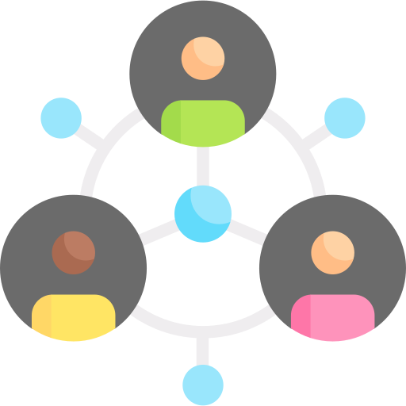
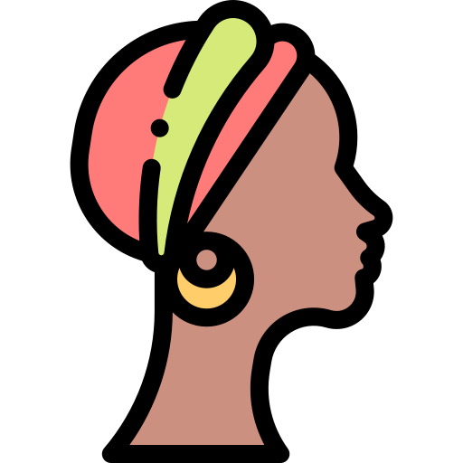

# About Page

## Premises Comp
```
<template>
    <!-- Componente principal -->
    <div class="premises">
        <!-- Seção de Inovação -->
        <div class="inovation">
            <!-- Ícone de Inovação (SVG) -->
            <svg version="1.0" xmlns="http://www.w3.org/2000/svg" viewBox="0 0 512.000000 512.000000"
                preserveAspectRatio="xMidYMid meet" data-aos="fade-in" data-aos-duration="1500">
                <!--... (conteúdo do SVG) ...-->
            </svg>
            <!-- Título "Inovação" -->
            <h2>Inovação</h2>
        </div>

        <!-- Seção de Cultura -->
        <div class="culture">
            <!-- Imagem de Cultura -->
            
            <!-- Título "Cultura" -->
            <h2>Cultura</h2>
        </div>
    </div>
</template>

<style lang="less" scoped>
/* Estilos do componente Vue.js */

/* Estilos para a seção principal 'premises' */
.premises {
    width: 100%;
    padding-bottom: 10%;
    display: flex;
}

/* Estilos para a seção 'inovation' */
.inovation {
    width: 50%;
    height: 100%;
    display: flex;
    align-items: center;
    justify-content: center;
    flex-direction: column;

    /* Estilos para o ícone SVG de inovação */
    svg {
        width: 50%;
        fill: #000000;
        margin-bottom: 2%;
    }

    /* Estilos para o título 'Inovação' */
    h2 {
        font-size: 50px;
    }
}

/* Estilos específicos para o título 'h2' */
h2 {
    color: #000000;
}

/* Estilos para o modo escuro */
.dark {
    .inovation {
        /* Ajuste de cor para o ícone SVG no modo escuro */
        svg {
            fill: #ffffff;
        }
    }

    /* Ajuste de cor para o título 'h2' no modo escuro */
    h2 {
        color: #ffffff;
    }
}

/* Estilos para a seção 'culture' */
.culture {
    width: 50%;
    height: 100%;
    display: flex;
    align-items: center;
    justify-content: center;
    flex-direction: column-reverse;

    /* Estilos para a imagem de cultura */
    img {
        width: 50%;
    }

    /* Estilos para o título 'Cultura' */
    h2 {
        font-size: 50px;
    }
}

/* Estilos responsivos para larguras de tela específicas */
@media only screen and (max-width: 912px) {
    .premises {
        /* Reorganização da disposição dos elementos para telas menores */
        flex-direction: column;
        align-items: center;
        padding-top: 2%;
        padding-bottom: 20%;
    }

    .inovation {
        /* Ajuste de margem inferior para a seção 'inovation' em telas menores */
        margin-bottom: 10%;
    }

    .culture {
        /* Reorganização da disposição dos elementos para telas menores */
        flex-direction: column;
    }
}

@media only screen and (max-width: 750px) {
    .inovation {
        /* Ajuste de tamanho para o ícone SVG em telas menores */
        svg {
            width: 70%;
        }
    }

    .culture {
        /* Ajuste de tamanho para a imagem de cultura em telas menores */
        img {
            width: 70%;
        }
    }
}

@media only screen and (max-width: 450px) {
    .inovation {
        /* Ajuste de tamanho para o ícone SVG em telas ainda menores */
        svg {
            width: 80%;
        }
    }

    .culture {
        /* Ajuste de tamanho para a imagem de cultura em telas ainda menores */
        img {
            width: 80%;
        }
    }
}
</style>

```
## Inovation Comp
```
<template>
    <!-- Componente principal -->
    <div class="inovation-comp">
        <!-- Seção de texto sobre inovação -->
        <div class="txt-inovation" data-aos="fade-right" data-aos-duration="1500">
            <!-- Título -->
            <h2>Inovação</h2>
            <!-- Parágrafo explicativo sobre inovação -->
            <p>
                <!-- Conteúdo do parágrafo -->
                Tomando como referência projetos inovadores e modernos, tivemos como um principal objetivo mostrar como 
                podemos apresentar uma cultura de maneira diferente a sites que vemos comumente, utilizando assim modelos 3Ds, 
                diversas interações com o usuário, bibliotecas como SwiperJS para carrosséis e a biblioteca
                AOS para animações com a rolagem do site.
            </p>
        </div>

        <!-- Seção do cubo 3D animado -->
        <div class="cube-inovation">
            <!-- Face superior do cubo -->
            <div class="top"></div>
            <!-- Faces laterais do cubo (usando pseudo-elementos 'span') -->
            <div>
                <span style="--i: 0"></span>
                <span style="--i: 1"></span>
                <span style="--i: 2"></span>
                <span style="--i: 3"></span>
            </div>
        </div>
    </div>
</template>

<style lang="less" scoped>
/* Estilos do componente Vue.js */

/* Estilos da seção principal 'inovation-comp' */
.inovation-comp {
    width: 100%;
    height: 70vh;
    display: flex;
    justify-content: center;
    align-items: center;
}

/* Estilos da seção do cubo 3D 'cube-inovation' */
.cube-inovation {
    display: flex;
    align-items: center;
    justify-content: center;
    position: relative;
    width: 50%;
    height: 100%;
    transform-style: preserve-3d;
    transform: rotateX(-30deg);
    animation: animate 10s linear infinite;
}

/* Animação do cubo */
@keyframes animate {
    0% {
        transform: rotateX(-30deg) rotateY(0deg);
    }

    100% {
        transform: rotateX(-30deg) rotateY(360deg);
    }
}

/* Estilos das faces do cubo */
.cube-inovation div {
    position: absolute;
    width: 300px;
    height: 300px;
    transform-style: preserve-3d;
}

/* Estilos dos pseudo-elementos 'span' (faces laterais do cubo) */
.cube-inovation div span {
    position: absolute;
    width: 100%;
    height: 100%;
    background: linear-gradient(#151515, rgb(93, 49, 49));
    transform: rotateY(calc(90deg * var(--i))) translateZ(150px);
}

/* Estilos da face superior do cubo */
.top {
    position: absolute;
    width: 300px;
    height: 300px;
    background: #222;
    transform: rotateX(90deg) translateZ(150px);
}

/* Estilos adicionais para a face superior do cubo */
.top::before {
    content: '';
    position: absolute;
    width: 300px;
    height: 300px;
    background: rgb(217, 131, 131);
    transform: translateZ(-300px);
    filter: blur(20px);
}

/* Estilos da seção de texto 'txt-inovation' */
.txt-inovation {
    width: 50%;
    height: 100%;
    display: flex;
    justify-content: center;
    align-items: center;
    flex-direction: column;

    /* Estilos para os elementos 'h2' e 'p' dentro da seção 'txt-inovation' */
    h2, p {
        color: #000;
        width: 80%;
    }

    /* Estilos específicos para o título 'h2' */
    h2 {
        font-size: 50px;
    }

    /* Estilos específicos para o parágrafo 'p' */
    p {
        font-size: 20px;
    }
}

/* Estilos para o modo escuro */
.dark {
    .txt-inovation {
        /* Estilos para o texto dentro da seção 'txt-inovation' no modo escuro */
        h2 {
            color: #ffffffde;
        }

        p {
            color: #fff;
        }
    }
}

/* Estilos responsivos para larguras de tela específicas */
@media only screen and (max-width: 1000px) {
    .cube-inovation div {
        width: 200px;
        height: 200px;
    }

    .cube-inovation div span {
        /* Ajuste de tamanho e posição para telas menores */
        transform: rotateY(calc(90deg * var(--i))) translateZ(100px);
    }

    .top {
        /* Ajuste de tamanho e posição para telas menores */
        width: 200px;
        height: 200px;
        transform: rotateX(90deg) translateZ(100px);
    }

    .top::before {
        /* Ajuste de tamanho e posição para telas menores */
        width: 200px;
        height: 200px;
        transform: translateZ(-200px);
    }

    .txt-inovation {
        /* Ajuste de tamanho de fonte para telas menores */
        h2 {
            font-size: 45px;
        }

        p {
            font-size: 18px;
        }
    }
}

@media only screen and (max-width: 800px) {
    .inovation-comp {
        /* Reorganização da disposição dos elementos para telas menores */
        flex-direction: column;
        height: 80vh;
    }

    .cube-inovation {
        /* Ajuste de altura e largura para telas menores */
        height: 50%;
        width: 100%;
    }

    .txt-inovation {
        /* Ajuste de altura e largura para telas menores */
        height: 50%;
        width: 95%;

        /* Ajuste de largura para elementos 'h2' e 'p' dentro da seção 'txt-inovation' */
        h2, p {
            width: 100%;
        }

        /* Ajuste de tamanho de fonte para telas menores */
        h2 {
            font-size: 40px;
        }

        p {
            font-size: 16px;
        }
    }
}

@media only screen and (max-width: 600px) {
    .txt-inovation {
        /* Ajuste de tamanho de fonte adicional para telas ainda menores */
        h2 {
            font-size: 35px;
        }

        p {
            font-size: 14px;
        }
    }
}

@media only screen and (max-width: 500px) {
    .inovation-comp {
        /* Ajuste de altura para telas ainda menores */
        height: 90vh;
    }

    .cube-inovation div {
        /* Ajuste de tamanho para telas ainda menores */
        width: 150px;
        height: 150px;
    }

    .cube-inovation div span {
        /* Ajuste de tamanho e posição para telas menores */
        transform: rotateY(calc(90deg * var(--i))) translateZ(75px);
    }

    .top {
        /* Ajuste de tamanho e posição para telas menores */
        width: 150px;
        height: 150px;
        transform: rotateX(90deg) translateZ(75px);
    }

    .top::before {
        /* Ajuste de tamanho e posição para telas menores */
        width: 150px;
        height: 150px;
        transform: translateZ(-150px);
    }
}

@media only screen and (max-width: 300px) {
    .txt-inovation {
        /* Ajuste de tamanho de fonte adicional para telas ainda menores */
        h2 {
            font-size: 30px;
        }

        p {
            font-size: 12px;
        }
    }
}
</style>

```
## Culture Premise
```
<template>
    <!-- Componente principal -->
    <div class="culture-premise">
        <!-- Seção do mapa cultural -->
        <div class="culture-map">
            <!-- Imagem do mapa cultural -->
            
        </div>
        
        <!-- Seção de texto cultural -->
        <div class="culture-txt" data-aos="fade-left" data-aos-duration="1500">
            <!-- Título -->
            <h2>Cultura</h2>
            <!-- Parágrafo explicativo sobre a cultura -->
            <p>
                <!-- Conteúdo do parágrafo -->
                Não podemos deixar de citar o mais importante desse projeto, a cultura. O reconhecimento das origens do nosso
                país que muitas vezes são esquecidas. No nosso caso, os Quilombolas, um povo que, ao analisarmos as
                formas e os meios de
                vida que os habitantes apresentam, vemos como as atividades e a cultura que eles desenvolvem tem
                relação com a nossa cultura e práticas como danças, músicas e religiões.
            </p>
        </div>
    </div>
</template>

<style lang="less" scoped>
/* Estilos do componente Vue.js */

/* Estilos da seção principal 'culture-premise' */
.culture-premise {
    width: 100%;
    height: 70vh;
    display: flex;
    justify-content: center;
    align-items: center;
    overflow: hidden;
}

/* Estilos da seção do mapa cultural 'culture-map' */
.culture-map {
    width: 50%;
    height: 100%;
    display: flex;
    align-items: center;
    justify-content: center;

    /* Estilos da imagem dentro da seção 'culture-map' */
    img {
        width: 50%;
    }
}

/* Estilos da seção de texto cultural 'culture-txt' */
.culture-txt {
    width: 50%;
    height: 100%;
    display: flex;
    justify-content: center;
    flex-direction: column;

    /* Estilos para os elementos 'h2' e 'p' dentro da seção 'culture-txt' */
    h2, p {
        color: #000;
        width: 80%;
    }

    /* Estilos específicos para o título 'h2' */
    h2 {
        font-size: 50px;
    }

    /* Estilos específicos para o parágrafo 'p' */
    p {
        font-size: 20px;
    }
}

/* Estilos para o modo escuro */
.dark {
    .culture-txt {
        /* Estilos para o texto dentro da seção 'culture-txt' no modo escuro */
        h2 {
            color: #ffffffde;
        }

        p {
            color: #fff;
        }
    }
}

/* Estilos responsivos para larguras de tela específicas */
@media only screen and (max-width: 1000px) {
    .culture-txt {
        /* Ajuste de tamanho de fonte para telas menores */
        h2 {
            font-size: 45px;
        }

        p {
            font-size: 18px;
        }
    }
}

@media only screen and (max-width: 800px) {
    .culture-premise {
        /* Reorganização da disposição dos elementos para telas menores */
        flex-direction: column-reverse;
        height: 80vh;
    }

    .culture-map {
        /* Ajuste de altura e largura para telas menores */
        height: 50%;
        width: 100%;
    }

    .culture-txt {
        /* Ajuste de altura e largura para telas menores */
        height: 50%;
        width: 95%;

        /* Ajuste de largura para elementos 'h2' e 'p' dentro da seção 'culture-txt' */
        h2, p {
            width: 100%;
        }

        /* Ajuste de tamanho de fonte para telas menores */
        h2 {
            font-size: 40px;
        }

        p {
            font-size: 16px;
        }
    }
}

@media only screen and (max-width: 600px) {
    .culture-txt {
        /* Ajuste de tamanho de fonte adicional para telas ainda menores */
        h2 {
            font-size: 35px;
        }

        p {
            font-size: 14px;
        }
    }
}

@media only screen and (max-width: 300px) {
    .culture-txt {
        /* Ajuste de tamanho de fonte adicional para telas ainda menores */
        h2 {
            font-size: 30px;
        }

        p {
            font-size: 12px;
        }
    }
}
</style>

```
## About Comp
```
<template>
    <!-- Componente principal -->
    <div class="about-comp">
        <!-- Seção de título -->
        <div class="title-about">
            <div>
                <!-- Título do projeto animado -->
                <h2 data-aos="fade-in">Projeto -</h2>
                <!-- Título principal do projeto animado com duração específica -->
                <h2 data-aos="fade-in" data-aos-duration="3000">Quilombolas</h2>
            </div>
        </div>

        <!-- Seção do logotipo -->
        <div class="logo-about">
            <!-- Logotipo em formato SVG -->
            <svg version="1.0" xmlns="http://www.w3.org/2000/svg" viewBox="0 0 1024.000000 1024.000000"
                preserveAspectRatio="xMidYMid meet">
                <metadata>
                    Created by potrace 1.16, written by Peter Selinger 2001-2019
                </metadata>
                <!-- Caminho SVG (dados omitidos) -->
                <g transform="translate(0.000000,1024.000000) scale(0.100000,-0.100000)" stroke="none">
                    <path "...dados SVG..."/>
                </g>
            </svg>
        </div>
    </div>
</template>

<style lang="less" scoped>
/* Estilos do componente Vue.js */

/* Estilos da seção principal 'about-comp' */
.about-comp {
    height: 100vh;
    width: 100%;
    display: flex;
    align-items: center;
    justify-content: center;
}

/* Estilos da seção de título 'title-about' */
.title-about {
    display: flex;
    justify-content: center;
    align-items: center;
    width: 50%;
    height: 100%;
    overflow: hidden;

    /* Estilos do título 'h2' dentro da seção 'title-about' */
    h2 {
        text-align: center;
        font-size: calc(4.5em + 1vw);
        color: #000;
    }
}

/* Estilos da seção do logotipo 'logo-about' */
.logo-about {
    width: 50%;
    height: 100%;
    display: flex;
    justify-content: center;
    align-items: center;
}

/* Estilos do elemento 'svg' dentro da seção 'logo-about' */
svg {
    width: 100%;
    height: auto;
    fill: #000;
}

/* Estilos para o modo escuro */
.dark {
    svg {
        fill: #ffffff;
    }

    .title-about h2 {
        color: #ffffff;
    }
}

/* Estilos responsivos para larguras de tela específicas */
@media only screen and (max-width: 1000px) {
    .title-about {
        /* Ajuste de tamanho de fonte para telas menores */
        h2 {
            font-size: calc(3em + 1vw);
        }
    }
}

@media only screen and (max-width: 800px) {
    .about-comp {
        /* Reorganização da disposição dos elementos para telas menores */
        flex-direction: column-reverse;
    }

    .title-about {
        /* Ajuste de tamanho e altura para telas menores */
        width: 100%;
        height: 50%;
    }

    .logo-about {
        /* Ajuste da altura e alinhamento para telas menores */
        align-items: flex-start;
        width: 100%;
        height: 50%;
    }

    svg {
        /* Ajuste de largura e altura para telas menores */
        width: auto;
        height: 130%;
    }

    .title-about {
        /* Ajuste de tamanho de fonte para telas menores */
        h2 {
            font-size: calc(2.8em + 1vw);
        }
    }
}

@media only screen and (max-width: 600px) {
    .title-about {
        /* Ajuste de tamanho de fonte adicional para telas ainda menores */
        h2 {
            font-size: calc(2.5em + 1vw);
        }
    }
}
</style>

```

## Creation Comp
```
<template>
    <div class="creation">
        <!-- Parte da imagem à esquerda -->
        <div class="programming-img">
            
        </div>
        
        <!-- Parte do texto à direita -->
        <div class="programming-txt" data-aos="fade-left" data-aos-duration="1500">
            <p>
                <!-- Conteúdo do parágrafo -->
                A iniciativa do Projeto Quilombolas surgiu na Etec de Carapicuíba pelo curso de Desenvolvimento de Sistemas,
                onde o principal objetivo era dar a visibilidade dos povos originários do Brasil, os quais muitas vezes não
                são lembrados na atualidade. <br>
                Vimos nesse projeto a oportunidade de apresentar a cultura brasileira para jovens de maneira mais moderna, para isso
                seguimos duas principais premissas:
            </p>
        </div>
    </div>
</template>

<script>
// Script do componente Vue.js
export default {
    // Nenhum dado ou método específico está sendo definido neste exemplo
}
</script>

<style lang="less" scoped>
/* Estilos do componente Vue.js */

/* Estilos da seção 'creation' */
.creation {
    height: 100vh;
    width: 100%;
    display: flex;
    align-items: center;
    justify-content: center;
    overflow: hidden;
}

/* Estilos da parte da imagem à esquerda */
.programming-img {
    height: 100%;
    width: 50%;
    display: flex;
    justify-content: center;
    align-items: center;

    /* Estilos da imagem */
    img {
        width: 80%;
    }
}

/* Estilos da parte do texto à direita */
.programming-txt {
    height: 100%;
    width: 50%;
    display: flex;
    align-items: center;
    justify-content: center;

    /* Estilos do parágrafo dentro do texto */
    p {
        font-size: 20px;
        width: 80%;
    }
}

/* Estilos para o modo escuro */
.dark {
    .programming-txt {
        p {
            color: #fff;
        }
    }
}

/* Estilos responsivos para larguras de tela específicas */
@media only screen and (max-width: 912px) {
    .creation {
        flex-direction: column;
    }

    .programming-img {
        height: 50%;
        width: 100%;

        img {
            width: 80%;
        }
    }

    .programming-txt {
        height: 50%;
        width: 100%;
        padding-top: 10%;
        display: flex;
        align-items: flex-start;
        justify-content: center;

        p {
            width: 85%;
            font-size: 18px;
        }
    }
}

@media only screen and (max-width: 612px) {
    .programming-txt {
        p {
            width: 85%;
            font-size: 16px;
        }
    }
}

@media only screen and (max-width: 300px) {
    .programming-txt {
        p {
            width: 90%;
            font-size: 14px;
        }
    }
}
</style>
```
# Feedback Docs

# Front 

## Template 

```
<div class="feedback">
    <!-- Seção de postagem -->
    <div class="post">
        <form method="post" @submit.prevent="postMessage" id="postMsg">
            <h2>Feedback</h2>
            <!-- Input para o nome do autor -->
            <div class="input-name">
                <input type="text" name="author" placeholder="Nome" v-model="posts.name" id="name" required maxlength="20">
            </div>
            <!-- Input para o comentário -->
            <div class="input-feedback">
                <input type="text" name="feedback" placeholder="Comentários" v-model="posts.feedback" id="feedback" required maxlength="50">
            </div>
            <!-- Botão de envio -->
            <button type="submit" class="btn">
                <!-- Ícone SVG animado -->
                <div class="svg-wrapper-1">
                    <div class="svg-wrapper">
                        <svg xmlns="http://www.w3.org/2000/svg" viewBox="0 0 24 24" width="24" height="24">
                            <path fill="none" d="M0 0h24v24H0z"></path>
                            <path fill="currentColor" d="M1.946 9.315c-.522-.174-.527-.455.01-.634l19.087-6.362c.529-.176.832.12.684.638l-5.454 19.086c-.15.529-.455.547-.679.045L12 14l6-8-8 6-8.054-2.685z"></path>
                        </svg>
                    </div>
                </div>
                <span>Enviar</span>
            </button>
        </form>
    </div>
    <!-- Seção de exibição de feedbacks -->
    <div class="get">
        <div class="juntar">
            <h2>Comentários</h2>
            <!-- Espaço onde os feedbacks são exibidos -->
        </div>
    </div>
</div>

```

## Script

- Dados (data): O objeto posts contém propriedades name e feedback vinculadas aos campos de entrada.

```
data() {
    return {
        posts: {
            name: '',
            feedback: ''
        }
    };
},

```

### Métodos (methods): O método postMessage é chamado quando o formulário é enviado. Ele envia uma solicitação POST com os dados do usuário para a API.
```

// Função assíncrona para enviar um post para a API
const submitPost = async () => {
    // Configuração das opções para a solicitação POST
    const options = {
        method: 'POST', // Método HTTP
        headers: {
            'Content-Type': 'application/json', // Tipo de conteúdo na requisição
        },
        body: JSON.stringify(this.posts), // Corpo da requisição convertido para JSON
    };

    try {
        // Envia a requisição para a URL da API com as opções configuradas
        const response = await fetch('https://quilombolas-backend.onrender.com/', options);

        // Verifica se a resposta foi bem-sucedida (código de status 2xx)
        if (response.ok) {
            // Exibe um alerta agradecendo pelo comentário
            alert('Obrigado pelo comentário ' + this.posts.name);
            // Reseta o formulário com id 'postMsg'
            document.getElementById('postMsg').reset();
            // Recarrega a página
            window.location.reload();
        } else {
            // Se a resposta não for bem-sucedida, exibe um erro no console
            console.error('Erro ao enviar o post:', response.statusText);
        }
    } catch (error) {
        // Se ocorrer um erro durante a requisição, exibe-o no console
        console.error('Erro durante a requisição:', error);
    }
};

// Chama a função submitPost
submitPost();

```

- submitPost: Função assíncrona que realiza uma solicitação POST para a API.

Configuração de Opções:

- method: Método HTTP (POST).
- headers: Cabeçalhos da requisição, especificamente o tipo de conteúdo como JSON.
- body: Corpo da requisição, convertido para JSON usando JSON.stringify(this.posts).
Tratamento de Erros:

1. Utiliza try e catch para lidar com erros de requisição.
2. Verifica se a resposta é bem-sucedida (response.ok) e realiza ações correspondentes.
Execução: A função submitPost é chamada imediatamente após ser definida, o que resulta na execução imediata do código.

### Hooks de Ciclo de Vida (mounted): No hook mounted, são carregados os feedbacks existentes da API e exibidos no máximo os últimos 4.

```
// Seleciona o primeiro elemento da classe CSS 'juntar' no documento HTML
const getClass = document.querySelector(".juntar");

// Realiza uma solicitação FETCH para a URL 'https://quilombolas-backend.onrender.com/'
fetch('https://quilombolas-backend.onrender.com/')
    // O método 'then' é usado para manipular a resposta da solicitação FETCH
    .then((res) => res.json())
    .then((data) => {
        // O método 'reverse' inverte a ordem dos elementos no array 'data'
        data.reverse().forEach((element, index) => {
            // Para os primeiros 4 elementos do array 'data'
            if (index < 4) {
                // Cria um novo elemento 'div' e o anexa ao elemento com a classe 'juntar'
                var div = getClass.appendChild(document.createElement('div'));
                // Cria um novo elemento 'h3' e o anexa ao elemento 'div'
                var htres = div.appendChild(document.createElement('h3'));
                // Cria um novo elemento 'p' e o anexa ao elemento 'div'
                var p = div.appendChild(document.createElement('p'));

                // Adiciona um nó de texto com o conteúdo do feedback ao elemento 'p'
                p.appendChild(document.createTextNode(element.feedback))
                // Adiciona um nó de texto com o conteúdo do nome seguido por ':' ao elemento 'htres'
                htres.appendChild(document.createTextNode(element.name + ":"))
            }
        });
    });

```

document.querySelector(".juntar"):

- Seleciona o primeiro elemento no documento HTML que possui a classe CSS 'juntar'.

fetch('https://quilombolas-backend.onrender.com/'):

- Realiza uma solicitação FETCH para a URL 'https://quilombolas-backend.onrender.com/'.

.then((res) => res.json()):

1. O método 'then' é usado para manipular a resposta da solicitação FETCH.
2. Converte a resposta para o formato JSON.

.then((data) => { ... }):

- Outro bloco 'then' para manipular os dados JSON obtidos da resposta.

data.reverse().forEach((element, index) => { ... }):

1. Inverte a ordem dos elementos no array 'data'.
2. Itera sobre cada elemento do array.

if (index < 4) { ... }:

- Verifica se o índice é menor que 4.

var div = getClass.appendChild(document.createElement('div'));:

- Cria um novo elemento 'div' e o anexa ao elemento com a classe 'juntar'.

var htres = div.appendChild(document.createElement('h3'));:

- Cria um novo elemento 'h3' e o anexa ao elemento 'div'.

var p = div.appendChild(document.createElement('p'));:

- Cria um novo elemento 'p' e o anexa ao elemento 'div'.

p.appendChild(document.createTextNode(element.feedback)):

- Adiciona um nó de texto ao elemento 'p' com o conteúdo do feedback do elemento atual.
htres.appendChild(document.createTextNode(element.name + ":")):

- Adiciona um nó de texto ao elemento 'htres' com o conteúdo do nome seguido por ':' do elemento atual.

# Back

```
// Importa os módulos necessários
const express = require('express');
const mongoose = require('mongoose');

// Cria uma instância do aplicativo Express
const app = express();

// Configuração do aplicativo
app.use(express.static('public')); // Serve arquivos estáticos na pasta 'public'
app.use(express.json({ limit: '100kb' })); // Aceita dados JSON com limite de 100KB

// Configuração do CORS (Cross-Origin Resource Sharing)
app.use((req, res, next) => {
    res.append('Access-Control-Allow-Origin', ['*']);
    res.append('Access-Control-Allow-Methods', 'GET,PUT,POST,DELETE');
    res.append('Access-Control-Allow-Headers', 'Content-Type');
    next();
});

// Porta em que o servidor irá escutar
const port = ...;

// Modelo do Mongoose para a coleção 'UserMessage'
const Message = mongoose.model('UserMessage', {
    name: String,
    feedback: String,
});

// Rota GET para obter todas as mensagens
app.get('/', async (req, res) => {
    const messages = await Message.find();
    return res.send(messages);
});

// Rota POST para adicionar uma nova mensagem
app.post('/', async (req, res) => {
    const message = new Message({
        name: req.body.name,
        feedback: req.body.feedback,
    });

    await message.save();
    return res.send(message);
});

// Rota PUT para atualizar uma mensagem por ID
app.put('/:id', async (req, res) => {
    const message = await Message.findByIdAndUpdate(
        req.params.id,
        {
            name: req.body.name,
            feedback: req.body.feedback,
        },
        {
            new: true,
        }
    );

    return res.send(message);
});

// Rota DELETE para excluir uma mensagem por ID
app.delete('/:id', async (req, res) => {
    const message = await Message.findByIdAndDelete(req.params.id);
    return res.send(message);
});

// Inicia o servidor na porta especificada
app.listen(port, () => {
    // Conecta-se ao banco de dados MongoDB usando a URL fornecida
    mongoose.connect('...');
    console.log(`Example app listening on port ${port}`);
});
```

- express e mongoose são módulos Node.js para simplificar o desenvolvimento web e a interação com o MongoDB, respectivamente.
- express.static('public'): Configura o Express para servir arquivos estáticos da pasta 'public'.
- express.json({ limit: '100kb' }): Configura o Express para aceitar dados JSON com um limite de 100KB.
- Configuração CORS (Access-Control-Allow-Origin): Permite solicitações de qualquer origem para acessar o recurso.
- const Message = mongoose.model('UserMessage', { ... });: Define um modelo Mongoose chamado 'UserMessage' com campos 'name' e 'feedback'.
- Rotas HTTP (app.get, app.post, app.put, app.delete): Define rotas para manipular operações CRUD no banco de dados MongoDB.
- Conexão ao banco de dados MongoDB (mongoose.connect(...)): Conecta-se ao banco de dados MongoDB usando a URL fornecida.
- app.listen(port, () => { ... });: Inicia o servidor Express na porta especificada.
