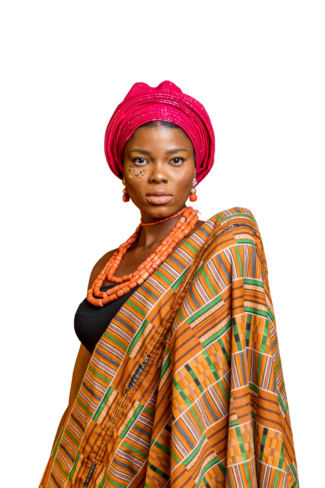
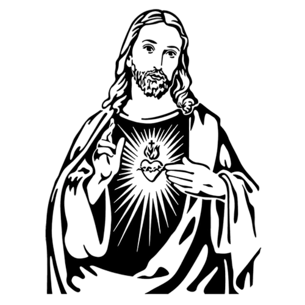

# Culture Page
# Aliments
```
<script setup>
// Importando componentes Swiper e SwiperSlide do pacote 'swiper/vue'
import { Swiper, SwiperSlide } from 'swiper/vue';

// Importando estilos do Swiper
import 'swiper/css';

// Importando estilos específicos do Swiper
import 'swiper/css/effect-coverflow';
import 'swiper/css/pagination';
import 'swiper/css/navigation';

// Importando módulos necessários do Swiper
import { EffectCoverflow, Pagination, Navigation } from 'swiper/modules';
</script>

<template>
    <div class="aliments">
        <!-- Componente Swiper com configurações -->
        <swiper :effect="'coverflow'" :navigation="true" :grabCursor="true" :centeredSlides="true" :slidesPerView="'auto'" :coverflowEffect="{
            rotate: 50,
            stretch: 0,
            depth: 100,
            modifier: 1,
            slideShadows: true,
        }" :pagination="{
            dynamicBullets: true,
        }" class="mySwiper" :modules="[EffectCoverflow, Pagination, Navigation]" data-aos="fade-left">

            <!-- Slides do Swiper -->
            <swiper-slide id="feijoada" class="swiper-slide-active">
                <div class="name">
                    <h3>Feijoada</h3>
                </div>
            </swiper-slide>
            <swiper-slide id="tapioca">
                <div class="name">
                    <h3>Tapioca</h3>
                </div>
            </swiper-slide>
            <swiper-slide id="manicoba">
                <div class="name">
                    <h3>Maniçoba</h3>
                </div>
            </swiper-slide>
            <swiper-slide id="acaraje">
                <div class="name">
                    <h3>Acarajé</h3>
                </div>
            </swiper-slide>
        </swiper>
    </div>
</template>

<script>
// Exportando o componente
export default {
    components: {
        Swiper,
        SwiperSlide,
    }
}
</script>

<style lang="less" scoped>
/* Estilos para o contêiner principal */
.aliments {
    width: 100%;
    height: fit-content;
    padding-top: 5%;
    padding-bottom: 5%;
    display: flex;
    align-items: center;
    justify-content: center;
}

/* Estilos para o componente Swiper */
.swiper {
    width: 100%;
    height: 100%;
}

/* Estilos para os slides do Swiper */
.swiper-slide {
    background-color: rgb(39, 39, 39);
    width: 40vh;
    height: 40vh;
    display: flex;
    align-items: flex-end;
    background-position: center;
    background-repeat: no-repeat;
    background-size: cover;

    /* Estilos para a área de nome no slide */
    .name {
        width: 100%;
        height: 30%;
        display: flex;
        justify-content: center;
        flex-direction: column;

        padding-left: 5%;
        background-color: rgba(0, 0, 0, 0.8);

        /* Estilos para o texto do nome */
        .state-card {
            color: rgb(179, 179, 179);
        }
    }
}

/* Estilos específicos para cada slide usando IDs */
#feijoada {
    background-image: url(../../assets/feijoada-aliments.jpg);
}

#tapioca {
    background-image: url(../../assets/tapioca-aliments.jpg);
}

#manicoba {
    background-image: url(../../assets/manicoba-aliments.jpg);
}

#acaraje {
    background-image: url(../../assets/acaraje-aliments.jpg);
}
</style>

```
## Culinary
```
<template>
  <!-- Componente Vue principal -->
  <div class="culinary-comp">
    <!-- Seção de texto -->
    <div class="text3">
      <!-- Título principal -->
      <h1 id="cul" data-aos="fade-right">Culinária</h1>
      <!-- Descrição da culinária quilombola -->
      <div class="textesculs" data-aos="fade-right">
        <p id="donts">
          Os quilombolas costumam usar ingredientes locais e sazonais em suas
          preferências. Raízes como a mandioca, inhame e batata-doce, bem como
          feijão, milho, frutas, peixes, aves e carnes de caça são componentes
          fundamentais de suas receitas.
          <br />
          A técnica de defumação é uma característica marcante da culinária
          quilombola, conferindo um sabor distintivo aos pratos.
        </p>
        <p id="tipo">Conheça alguns Pratos Típicos: </p>
      </div>
    </div>

    <!-- Seção de imagem -->
    <div id="div-imagem"></div>
  </div>
</template>

<style scoped>
/* Estilos CSS escopados para o componente Vue */

/* Estilos para o contêiner principal */
.culinary-comp {
  display: flex;
  width: 100%;
  height: 70vh;
  overflow: hidden;
}

/* Estilos para a div de imagem */
#div-imagem {
  width: 40%;
  height: 100%;
  background-image: url(../../assets/Culinary.jpg);
  background-size: cover;
  background-repeat: no-repeat;
  background-position: center;
}

/* Estilos para a seção de texto */
.text3 {
  width: 60%;
  height: 100%;
  background-color: #6C1522;
  display: flex;
  flex-direction: column;
  justify-content: center;
  align-items: center;
}

/* Estilos para o título principal */
#cul {
  width: 80%;
  font-size: 60px;
  color: aliceblue;
}

/* Estilos para a descrição da culinária */
.textesculs {
  width: 80%;
  display: flex;
  flex-direction: column;
  justify-content: center;
  font-size: 18px;
  color: aliceblue;
}

/* Estilos para a descrição da culinária em telas pequenas */
@media screen and (max-height: 650px) {
  .textesculs {
    font-size: 15px;
  }
}

/* Estilos para telas médias */
@media screen and (max-width: 1000px) {
  .culinary-comp {
    flex-direction: column-reverse;
    height: 80vh;
  }

  #div-imagem {
    width: 100%;
    height: 40%;
  }

  .text3 {
    padding-left: 2%;
    padding-right: 2%;
    padding-top: 5%;
    width: 100%;
    height: 60%;
    background-color: #6C1522;
    display: flex;
    flex-direction: column;
    justify-content: flex-start;
    align-items: center;
  }

  #cul {
    width: 100%;
    font-size: 50px;
  }

  .textesculs {
    width: 100%;
    font-size: 14px;
  }
}

/* Estilos para telas pequenas */
@media screen and (max-width: 600px) {
  #div-imagem {
    height: 35%;
  }

  .text3 {
    height: 65%;
  }

  #cul {
    font-size: calc(26px + 1vw);
  }

  .textesculs {
    font-size: 11px;
  }
}

/* Estilos para telas muito pequenas */
@media screen and (max-width: 300px) {
  #cul {
    font-size: calc(22px + 1vw);
  }

  .textesculs {
    font-size: 10px;
  }
}
</style>

```
## Culture
```
<template>
  <!-- Componente Vue principal -->
  <div class="culture-comp">
    <!-- Seção de texto -->
    <div class="texts">
      <!-- Título principal -->
      <h1 id="title" data-aos="fade-left">Cultura</h1>
      <!-- Parágrafo descritivo sobre o patrimônio cultural -->
      <p id="text-1">
        Apesar de muitas vezes ser confundido apenas com a ideia de monumentos e
        com conceitos de patrimônio material, o patrimônio cultural é mais que
        isso, ele está ligado à produção da identidade e da territorialidade, ele
        está fundamentado na referência de processos culturais.
      </p>
    </div>

    <!-- Elemento retangular decorativo -->
    <div class="retang"></div>
  </div>
</template>

<style scoped>
/* Estilos CSS escopados para o componente Vue */

/* Estilos para o contêiner principal */
.culture-comp {
  width: 100%;
  height: 80vh;
  display: flex;
  background-color: #440a13;
  overflow: hidden;
}

/* Estilos para a seção de texto */
.texts {
  z-index: 1;
  width: 60%;
  position: absolute;
  top: 10%;
  margin-left: 5%;
}

/* Estilos para o título principal */
#title {
  font-size: calc(5em + 1vw);
  letter-spacing: 8px;
  color: #f5f5f5;
}

/* Estilos para o parágrafo descritivo */
#text-1 {
  margin: 0;
  margin-top: 2%;
  font-size: 26px;
  color: aliceblue;
  width: 80%;
}

/* Estilos para o elemento retangular decorativo */
.retang {
  position: absolute;
  z-index: 0;
  width: 20%;
  height: 62%;
  background-color: #6d212b;
  right: 35%;
}

/* Estilos para telas médias */
@media (max-width: 1024px) {
  #title {
    font-size: calc(4.5em + 1vw);
    letter-spacing: 6px;
  }

  #text-1 {
    font-size: 20px;
  }
}

/* Estilos para telas pequenas */
@media (max-width: 600px) {
  .culture-comp {
    height: 70vh;
  }

  .texts {
    width: 90%;
    position: absolute;
    top: 15%;
  }

  #title {
    font-size: calc(4em + 1vw);
    letter-spacing: 4px;
  }

  #text-1 {
    font-size: 16px;
    margin-top: 7%;
  }

  .retang {
    width: 22%;
    height: 25%;
    background-color: #6d212b;
    right: 20%;
  }
}

/* Estilos para telas muito pequenas */
@media (max-width: 300px) {
  .culture-comp {
    height: 80vh;
  }

  .texts {
    width: 90%;
    position: absolute;
    top: 10%;
  }

  #title {
    font-size: calc(3.5em + 1vw);
  }

  #text-1 {
    font-size: 14px;
    margin-top: 9%;
  }
}
</style>

```
## Dances - Apresentation
```
<template>
  <!-- Componente Vue principal -->
  <div class="dances-apresentation">
    <!-- Título com efeito de fade-in e duração de 1500ms -->
    <h2 data-aos="fade-in" data-aos-duration="1500">Danças e Religião</h2>
  </div>
</template>

<style lang="less" scoped>
/* Estilos CSS escopados para o componente Vue */

/* Estilos para o contêiner principal */
.dances-apresentation {
  width: 100%;
  height: 100vh;
  background-image: url(../../assets/background-dances.png);
  background-position: center right 45%;
  background-repeat: no-repeat;
  background-size: cover;
  display: flex;
  align-items: center;
  justify-content: center;
}

/* Estilos para o título */
h2 {
  width: 95%;
  text-align: center;
  font-size: calc(5em + 1vw);
}

/* Estilos responsivos para telas médias */
@media screen and (max-width: 1024px) {
  h2 {
    font-size: calc(4em + 1vw);
  }
}

/* Estilos responsivos para telas pequenas */
@media screen and (max-width: 600px) {
  h2 {
    font-size: calc(3em + 1vw);
  }
}

/* Estilos responsivos para telas muito pequenas */
@media screen and (max-width: 300px) {
  h2 {
    font-size: calc(2em + 1vw);
  }
}
</style>

```
## Dances
```
<script setup>
// Importa os componentes necessários do Swiper
import { Swiper, SwiperSlide } from "swiper/vue";
import { Pagination, Navigation } from "swiper/modules";

// Importa os estilos do Swiper
import 'swiper/css/navigation';
import "swiper/css";
import "swiper/css/pagination";

</script>

<template>
  <!-- Componente principal -->
  <div class="dances-comp">
    <!-- Swiper container -->
    <Swiper :modules="[Pagination, Navigation]" :grabCursor="true" :lazy="true" :navigation="true"
      :pagination="{ dynamicBullets: true, }" class="slider">
      <!-- Slides do Swiper -->
      <SwiperSlide class="dance">
        <!-- Conteúdo do slide -->
        <div class="img-dance" id="capo"></div>
        <div class="text-dance" data-aos="fade-left" data-aos-duration="1500">
          <div class="title">
            <h2 class="capoeira">Capoeira</h2>
          </div>
          <div class="text">
            <p class="capoeira">
              <!-- Texto sobre a Capoeira -->
            </p>
          </div>
        </div>
      </SwiperSlide>
      <!-- Outros slides com estrutura semelhante -->
    </Swiper>
  </div>
</template>

<script>
// Exporta o componente
export default {
  // Registra os componentes Swiper e SwiperSlide
  components: {
    Swiper,
    SwiperSlide,
  }
}
</script>

<style lang="less" scoped>
/* Estilos do componente */

/* Estilos da classe dances-comp */
.dances-comp {
  width: 100%;
  height: 100vh;
  display: flex;
  background-color: #6d212b;
}

/* Estilos da classe dance */
.dance {
  display: flex;
}

/* Estilos da classe img-dance */
.img-dance {
  background-size: cover;
  background-position: center;
  background-repeat: no-repeat;
  width: 50%;
  height: 100%;
  transition: opacity .5s linear;
}

/* Estilos específicos para cada imagem (usando IDs) */
#capo {
  background-image: url(../../assets/CapoeiraEarle.jpg);
}
/* Outros estilos de img-dance para outras imagens */

/* Estilos quando hover na imagem */
.img-dance:hover {
  opacity: 0.9;
}

/* Estilos da classe text-dance */
.text-dance {
  padding: 5%;
  width: 50%;
  height: 100%;
  display: flex;
  flex-direction: column;
  justify-content: center;
  color: aliceblue;
}

/* Estilos para tamanhos diferentes de tela usando media queries */
@media screen and (max-width: 1000px) {
  /* Estilos para telas até 1000px de largura */
}

@media screen and (max-width: 800px) {
  /* Estilos para telas até 800px de largura */
}

@media screen and (max-width: 600px) {
  /* Estilos para telas até 600px de largura */
}

@media screen and (max-width: 400px) {
  /* Estilos para telas até 400px de largura */
}
</style>

```
## Social - Moviments
```
<template>
  <!-- Componente principal para exibir informações sobre movimentos sociais -->
  <div class="social-moviments">
    <!-- Div para exibir imagem relacionada -->
    <div class="img-1">
      
    </div>
    <!-- Div para exibir texto e botão -->
    <div class="texts2">
      <!-- Título do componente -->
      <div class="titulo2" data-aos="fade-left" data-aos-duration="1500">
        <h1 id="title2">Movimentos Sociais</h1>
      </div>
      <!-- Texto explicativo sobre a importância dos movimentos sociais negros -->
      <p id="text-2" data-aos="fade-left" data-aos-duration="1500">
        <!-- Conteúdo do texto -->
      </p>
      <!-- Botão Saiba Mais com link externo -->
      <a
        href="https://www.brasilparalelo.com.br/artigos/black-lives-matter"
        target="_blank"
        data-aos="fade-left"
        data-aos-duration="1500"
      >
        <button class="learn-more">
          <!-- Ícone circular e seta no botão -->
          <span class="circle" aria-hidden="true">
            <span class="icon arrow"></span>
          </span>
          <!-- Texto do botão -->
          <span class="button-text">Saiba Mais</span>
        </button>
      </a>
    </div>
  </div>
</template>

<style scoped>
/* Estilos específicos para o componente social-moviments */

/* Estilos da classe social-moviments */
.social-moviments {
  width: 100%;
  height: 100vh;
  display: flex;
  overflow: hidden;
}

/* Estilos da classe img-1 */
.img-1 {
  background-color: white;
  width: 50%;
  height: 100%;
  display: flex;
  align-items: flex-end;
  justify-content: center;
}

/* Estilos da imagem woman */
#woman {
  width: 75vh;
}

/* Estilos da classe texts2 */
.texts2 {
  background-color: #6d212b;
  display: flex;
  justify-content: center;
  flex-direction: column;
  height: 100%;
  width: 50%;
  padding-left: 1%;
}

/* Estilos do título title2 */
#title2 {
  color: aliceblue;
  font-size: calc(35px + 1vw);
}

/* Estilos do texto text-2 */
#text-2 {
  color: aliceblue;
  font-size: 18px;
}

/* Estilos do botão learn-more */
button {
  position: absolute;
  display: inline-block;
  cursor: pointer;
  outline: none;
  border: 0;
  vertical-align: middle;
  text-decoration: none;
  background: transparent;
  padding: 0;
  font-size: inherit;
  font-family: inherit;
}

button.learn-more {
  width: 12rem;
  height: auto;
}

/* Estilos do círculo e seta no botão */
button.learn-more .circle {
  transition: all 0.45s cubic-bezier(0.65, 0, 0.076, 1);
  position: relative;
  display: block;
  margin: 0;
  width: 3rem;
  height: 3rem;
  background: #ffffff;
  border-radius: 1.625rem;
}

button.learn-more .circle .icon {
  transition: all 0.45s cubic-bezier(0.65, 0, 0.076, 1);
  position: absolute;
  top: 0;
  bottom: 0;
  margin: auto;
  background: #ffffff;
}

button.learn-more .circle .icon.arrow {
  transition: all 0.45s cubic-bezier(0.65, 0, 0.076, 1);
  left: 0.625rem;
  width: 1.125rem;
  height: 0.125rem;
  background: none;
}

button.learn-more .circle .icon.arrow::before {
  position: absolute;
  content: "";
  top: -0.29rem;
  right: 0.0625rem;
  width: 0.625rem;
  height: 0.625rem;
  border-top: 0.125rem solid #000000;
  border-right: 0.125rem solid #000000;
  transform: rotate(45deg);
}

/* Estilos do texto no botão */
button.learn-more .button-text {
  transition: all 0.45s cubic-bezier(0.65, 0, 0.076, 1);
  position: absolute;
  top: 0;
  left: 0;
  right: 0;
  bottom: 0;
  padding: 0.75rem 0;
  margin: 0 0 0 1.85rem;
  color: #ffffff;
  font-weight: 700;
  line-height: 1.6;
  text-align: center;
  text-transform: uppercase;
}

/* Estilos quando hover no botão */
button:hover .circle {
  width: 100%;
}

button:hover .circle .icon.arrow {
  background: #000000;
  transform: translate(1rem, 0);
}

button:hover .button-text {
  color: #000000;
}

/* Media queries para tamanhos diferentes de tela */
@media (max-height: 600px) {
  #text-2 {
    font-size: 16px;
  }
}

@media (max-width: 1000px) {
  .social-moviments {
    flex-direction: column;
  }

  .img-1 {
    width: 100%;
    height: 50%;
  }

  .texts2 {
    justify-content: flex-start;
    padding-top: 2%;
    height: 50%;
    width: 100%;
  }

  #title2 {
    font-size: calc(30px + 1vw);
  }

  #text-2 {
    font-size: 14px;
  }

  #woman {
    width: 40vh;
  }

  .button-text {
    font-size: 14px;
  }
}

@media screen and (max-width: 600px) {
  .img-1 {
    width: 100%;
    height: 40%;
  }

  #woman {
    width: 30vh;
  }

  #title2 {
    font-size: calc(26px + 1vw);
  }

  .texts2 {
    justify-content: flex-start;
    padding-top: 1%;
    height: 60%;
    width: 100%;
  }

  #text-2 {
    font-size: 

```
## Religion
```
<template>
  <!-- Componente principal para exibir informações sobre religiões -->
  <div class="religion">
    <!-- Cartão de religião (Catolicismo) -->
    <div class="card-religion" data-aos="fade-up" data-aos-duration="1500">
      <div class="img-religion">
        
      </div>
      <div class="name-religion">
        <h2>Catolicismo</h2>
        <p>
          <!-- Descrição do Catolicismo -->
        </p>
      </div>
    </div>

    <!-- Cartão de religião (Umbanda) -->
    <div class="card-religion" id="second-card" data-aos="fade-down" data-aos-duration="1500">
      <div class="img-religion">
        
      </div>
      <div class="name-religion">
        <h2>Umbanda</h2>
        <p>
          <!-- Descrição da Umbanda -->
        </p>
      </div>
    </div>

    <!-- Cartão de religião (Candomblé) -->
    <div class="card-religion" data-aos="fade-up" data-aos-duration="1500">
      <div class="img-religion">
        
      </div>
      <div class="name-religion">
        <h2>Candomblé</h2>
        <p>
          <!-- Descrição do Candomblé -->
        </p>
      </div>
    </div>
  </div>
</template>

<style lang="less" scoped>
/* Estilos específicos para o componente religion */

/* Estilos da classe religion */
.religion {
  width: 100%;
  padding: 10% 0;
  display: flex;
  align-items: center;
  justify-content: space-evenly;
}

/* Estilos da classe card-religion */
.card-religion {
  width: 20%;
  height: 30vw;
  background-color: #6C1522;
  position: relative;
  border-radius: 5%;
  overflow: hidden;
  box-shadow: 0 8px 20px 0 rgba(147, 147, 147, 0.37);
  transition: all .5s linear;
  user-select: none;
}

/* Estilos da classe img-religion */
.img-religion {
  overflow: hidden;
  display: flex;
  align-items: center;
  justify-content: center;
  height: 70%;
  width: 100%;
}

/* Estilos para a imagem dentro de img-religion */
.img-religion img {
  width: 15vw;
  height: 15vw;
}

/* Estilos da classe name-religion */
.name-religion {
  position: absolute;
  bottom: 0;
  background-color: rgba(0, 0, 0, 0.6);
  width: 100%;
  max-height: 20%;
  padding: 5%;
  transition: all .8s ease-out;
  overflow: hidden;
}

/* Estilos para o título dentro de name-religion */
.name-religion h2 {
  font-size: 30px;
}

/* Estilos para o texto dentro de name-religion */
.name-religion p {
  opacity: 0;
  color: white;
  font-size: 14px;
}

/* Estilos ao passar o mouse sobre card-religion */
.card-religion:hover {
  background-color: #6d212b;

  /* Estilos ao passar o mouse sobre name-religion dentro de card-religion */
  .name-religion {
    max-height: 90%;
    background-color: rgba(0, 0, 0, 0.8);

    /* Estilos para o título e texto ao passar o mouse */
    h2 {
      font-size: 28px;
    }

    p {
      opacity: 1;
    }
  }
}

/* Media queries para tamanhos diferentes de tela */
@media only screen and (max-width: 1324px) {
  .name-religion {
    /* Ajustes de fonte para telas até 1324px de largura */
    h2 {
      font-size: 35px;
    }

    p {
      font-size: 18px;
    }
  }
}

@media only screen and (max-width: 1024px) {
  .name-religion {
    /* Ajustes de fonte para telas até 1024px de largura */
    h2 {
      font-size: 25px;
    }

    p {
      font-size: 12px;
    }

    /* Ajustes para card-religion ao passar o mouse */
    .card-religion:hover {
      .name-religion {
        h2 {
          font-size: 23px;
        }
      }
    }
  }
}

@media only screen and (max-width: 900px) {
  /* Ajustes para telas até 900px de largura */
  .religion {
    flex-direction: column;
  }

  .card-religion {
    margin: 5% 0;
    width: 30%;
   

```
