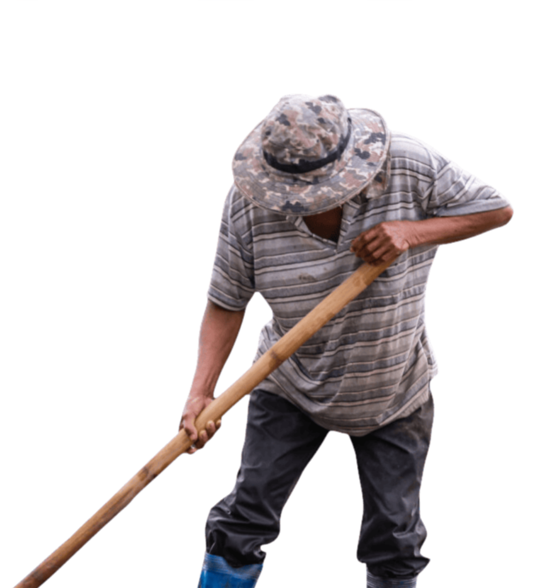

# Produtions page
## Agriculture Card
```
<template>
    <!-- Componente de cartões agrícolas -->
    <div class="agriculture-card">
        <!-- Container do primeiro cartão -->
        <div class="card-container" data-aos="fade-right" data-aos-duration="3000">
            <!-- Cartão com frente e verso -->
            <div class="card">
                <!-- Frente do cartão - Arroz -->
                <div class="front" id="arroz">
                    <h2 class="food-name">Arroz</h2>
                    <div class="space"></div>
                </div>
                <!-- Verso do cartão - Informações sobre o arroz -->
                <div class="back">
                    <p>Antes da chegada dos portugueses, era cultivado pelos tupis nos alagados próximos ao litoral, mas com
                        a chegada, também foi descoberto seu uso pelos africanos, sendo um dos principais alimentos usados
                        nos navios negreiros.</p>
                </div>
            </div>
        </div>
        <!-- Container do segundo cartão -->
        <div class="card-container" data-aos="fade-right" data-aos-duration="1500">
            <div class="card">
                <!-- Frente do cartão - Inhame -->
                <div class="front" id="inhame">
                    <h2 class="food-name">Inhame</h2>
                    <div class="space"></div>
                </div>
                <!-- Verso do cartão - Informações sobre o inhame -->
                <div class="back">
                    <p>Esse tubérculo chegou ao Brasil por meio dos navios portugueses que traziam escravizados, e
                        por fazer parte da culinária africana chegou ao Brasil e que por consequência se disseminou pelos
                        quilombos.</p>
                </div>
            </div>
        </div>
        <!-- Container do terceiro cartão -->
        <div class="card-container" data-aos="fade-right" data-aos-duration="750">
            <div class="card">
                <!-- Frente do cartão - Milho -->
                <div class="front" id="milho">
                    <h2 class="food-name">Milho</h2>
                    <div class="space"></div>
                </div>
                <!-- Verso do cartão - Informações sobre o milho -->
                <div class="back">
                    <p>O cultivo do milho vem desde antes da chegada dos europeus. Os indígenas tinham o cereal como
                        principal ingrediente de sua dieta, mas com a chegada dos portugueses, o consumo aumentou e produtos
                        a base de milho foram incorporados aos hábitos alimentares dos brasileiros.</p>
                </div>
            </div>
        </div>
        <!-- Linha no meio da tela -->
        <div class="line-in-middle"></div>
    </div>
</template>

<script>
export default {
    // Lógica do componente vai aqui, se necessário
}
</script>

<style scoped>
@import url(./Cards.css);

.agriculture-card {
    padding-top: 10%;
    padding-bottom: 10%;
    width: 100%;
    display: flex;
    justify-content: space-evenly;
    align-items: center;
    overflow: hidden;
}

.line-in-middle {
    position: absolute;
    z-index: -1;
    width: 100%;
    height: 30%;
    background-color: #100404d7;
    transition: all 1s linear;
}

/* Estilo escuro para a linha no meio da tela */
.dark .line-in-middle {
    background-color: #925959d7;
}

.food-name {
    position: absolute;
    bottom: 10%;
    left: 10%;
}

.space {
    height: 30%;
    width: 100%;
    background-color: rgba(0, 0, 0, 0.8);
}

/* Estilos específicos para os IDs dos alimentos */
#arroz {
    background-image: url(../../assets/cards/Arroz.png);
}

#inhame {
    background-image: url(../../assets/cards/Inhame.png);
}

#milho {
    background-image: url(../../assets/cards/Milho.png);
}

/* Estilos responsivos para telas pequenas */
@media only screen and (max-width: 600px) {
    .line-in-middle {
        position: absolute;
        z-index: -1;
        width: 100%;
        height: 25%;
        background-color: #100404d7;
        transition: all 1s linear;
    }
}
</style>

```

## AgricultureComp

```
<template>
    <!-- Componente principal de agricultura -->
    <div class="agriculture-comp">
        <!-- Título "Agricultura" com animação de fade-in -->
        <h2 class="agricultura" data-aos="fade-in" data-aos-duration="1500">Agricultura</h2>
        <!-- Título "Familiar" com animação de fade-in -->
        <h2 class="familiar" data-aos="fade-in" data-aos-duration="1500">Familiar</h2>
        <!-- Imagem de Seu Armando arando a terra -->
        <div class="armando-img">
            
        </div>
    </div>
</template>

<script>
export default {
    // Lógica do componente vai aqui, se necessário
}
</script>

<style lang="less" scoped>
.agriculture-comp {
    overflow: hidden;
    background-image: url(../../assets/background-armando.png);
    background-size: cover;
    background-repeat: no-repeat;
    background-position: bottom center;
    height: 100vh;
    width: 100%;
    display: flex;
    justify-content: center;
    align-items: center;
}

.armando-img {
    height: 100%;
    display: flex;
    align-items: flex-end;
    justify-content: center;
    z-index: 0;

    img {
        width: calc(40vh + 30vw);
        height: auto;
    }
}

/* Estilo para o título */
.title {
    position: absolute;
    width: 100%;
}

.agricultura {
    position: absolute;
    z-index: 1;
    height: calc(10% + 40vw);
}

.familiar {
    position: absolute;
    z-index: 1;
    height: calc(5% + 10vw);
}

/* Estilo para todos os títulos h2 */
h2 {
    font-size: calc(15em + 1vw);
}

/* Estilos responsivos para telas de tamanho médio */
@media only screen and (max-width: 1450px) {
    .agricultura {
        height: calc(5% + 40vw);
    }

    .familiar {
        height: calc(10vw);
    }

    h2 {
        font-size: calc(13em + 1vw);
    }
}

/* Estilos responsivos para telas pequenas */
@media only screen and (max-width: 1180px) {
    .armando-img {
        img {
            width: calc(40vh + 30vw);
        }
    }

    .agricultura {
        height: calc(10% + 20vw);
    }

    .familiar {
        height: calc(1vh + 1vw);
    }

    h2 {
        font-size: calc(10em + 1vw);
    }
}

/* Estilos responsivos para telas muito pequenas */
@media only screen and (max-width: 1000px) {
    .armando-img {
        img {
            width: calc(30vh + 40vw);
        }
    }

    .agricultura {
        height: calc(15% + 20vw);
    }

    .familiar {
        height: calc(1vw);
    }

    h2 {
        font-size: calc(8em + 1vw);
    }
}

/* Estilos responsivos para telas extra pequenas */
@media only screen and (max-width: 850px) {
    .armando-img {
        img {
            width: calc(30vh + 40vw);
        }
    }

    .agricultura {
        height: calc(13% + 20vw);
    }

    .familiar {
        height: calc(1vw);
    }

    h2 {
        font-size: calc(8em);
    }
}

/* Estilos responsivos para telas muito pequenas */
@media only screen and (max-width: 675px) {
    .armando-img {
        img {
            width: calc(40vh + 30vw);
        }
    }

    .agricultura {
        height: calc(35vw);
    }

    .familiar {
        height: calc(1vw);
    }

    h2 {
        font-size: calc(5em + 1vw);
    }
}

/* Estilos responsivos para telas pequenas */
@media only screen and (max-width: 475px) {
    .armando-img {
        img {
            width: calc(40vh + 30vw);
        }
    }

    .agricultura {
        height: calc(33vw);
    }

    .familiar {
        height: calc(1vw);
    }

    h2 {
        font-size: calc(4em + 1vw);
    }
}

/* Estilos responsivos para telas muito pequenas */
@media only screen and (max-width: 375px) {
    .armando-img {
        img {
            width: calc(40vh + 30vw);
        }
    }

    .agricultura {
        height: calc(30vw);
    }

    .familiar {
        height: calc(1vw);
    }

    h2 {
        font-size: calc(3em + 1vw);
        letter-spacing: 5px;
    }
}

/* Estilos responsivos para telas muito pequenas */
@media only screen and (max-width: 330px) {
    .armando-img {
        img {
            width: calc(40vh + 30vw);
        }
    }

    .agricultura {
        height: calc(40vw);
    }

    .familiar {
        height: calc(1vw);
    }

    h2 {
        font-size: calc(3em + 1vw);
        letter-spacing: 1px;
    }
}
</style>

```

## ArtesanatoCard

```
<template>
    <!-- Componente de cartões de artesanato -->
    <div class="artesanato-card">
        <!-- Container do primeiro cartão -->
        <div class="card-container" data-aos="fade-left" data-aos-duration="750">
            <!-- Cartão com frente e verso -->
            <div class="card">
                <!-- Frente do cartão - Palha de bananeira -->
                <div class="front" id="bananeira">
                    <h2 class="food-name">Palha de bananeira</h2>
                    <div class="space"></div>
                </div>
                <!-- Verso do cartão - Informações sobre a palha de bananeira -->
                <div class="back">
                    <p>O artesanato com a palha da bananeira possibilita a confecção de uma grande variedade de produtos
                        tais como cestas, bolsas, sandálias, tapetes, entre diversos outros.</p>
                </div>
            </div>
        </div>
        <!-- Container do segundo cartão -->
        <div class="card-container" data-aos="fade-left" data-aos-duration="1500">
            <div class="card">
                <!-- Frente do cartão - Capim Dourado -->
                <div class="front" id="dourado">
                    <h2 class="food-name">Capim Dourado</h2>
                    <div class="space"></div>
                </div>
                <!-- Verso do cartão - Informações sobre o capim dourado -->
                <div class="back">
                    <p>A tradição do artesanato com o capim dourado, o “ouro do cerrado”, foi passada pelos índios da etnia
                        Xerente que no começo do século XX saíram caminhando pelo lado do Rio Araguaia, no qual passaram
                        pelo
                        povoado quilombola Mumbuca e ensinaram alguns moradores a “costurar capim” com a seda de buriti.
                    </p>
                </div>
            </div>
        </div>
        <!-- Container do terceiro cartão -->
        <div class="card-container" data-aos="fade-left" data-aos-duration="3000">
            <div class="card">
                <!-- Frente do cartão - Piaçava -->
                <div class="front" id="piacava">
                    <h2 class="food-name">Piaçava</h2>
                    <div class="space"></div>
                </div>
                <!-- Verso do cartão - Informações sobre a piaçava -->
                <div class="back">
                    <p>O manejo extrativista da piaçava na região é uma herança ancestral dos
                        povos originários que habitavam esse território antes chegada dos
                        colonizadores.</p>
                </div>
            </div>
        </div>
        <!-- Linha no meio da tela -->
        <div class="line-in-middle"></div>
    </div>
</template>

<script>
export default {
    // Lógica do componente vai aqui, se necessário
}
</script>

<style scoped>
@import url(./Cards.css);

.artesanato-card {
    padding-top: 10%;
    padding-bottom: 10%;
    width: 100%;
    display: flex;
    justify-content: space-evenly;
    align-items: center;
    overflow: hidden;
}

.line-in-middle {
    position: absolute;
    z-index: -1;
    width: 100%;
    height: 30%;
    background-color: #100404d7;
    transition: all 1s linear;
}

/* Estilo escuro para a linha no meio da tela */
.dark .line-in-middle {
    background-color: #925959d7;
}

.food-name {
    position: absolute;
    bottom: 10%;
    left: 10%;
}

.space {
    height: 30%;
    width: 100%;
    background-color: rgba(0, 0, 0, 0.8);
}

/* Estilos específicos para os IDs dos materiais de artesanato */
#bananeira {
    background-image: url(../../assets/cards/fibraBananeira.png);
}

#dourado {
    background-image: url(../../assets/cards/capimDourado.png);
}

#piacava {
    background-image: url(../../assets/cards/piacava.png);
}

/* Estilos responsivos para telas médias */
@media only screen and (max-width: 1000px) {
    #bananeira h2,
    #dourado h2 {
        bottom: 2%;
    }
}

/* Estilos responsivos para telas pequenas */
@media only screen and (max-width: 600px) {
    .line-in-middle {
        position: absolute;
        z-index: -1;
        width: 100%;
        height: 25%;
        background-color: #100404d7;
        transition: all 1s linear;
    }

    #bananeira h2,
    #dourado h2 {
        font-size: 18px;
        bottom: 10%;
        left: 5%;
    }
}

/* Estilos responsivos para telas muito pequenas */
@media only screen and (max-width: 500px) {
    #bananeira h2,
    #dourado h2 {
        bottom: 5%;
    }
}

/* Estilos responsivos para telas ainda menores */
@media only screen and (max-width: 400px) {
    #bananeira h2,
    #dourado h2 {
        bottom: 3%;
        font-size: 15px;
    }
}
</style>

```
## ArtesanatoComp

```
<template>
    <!-- Componente de seção de artesanato -->
    <div class="artesanato">
        <!-- Título "Artesanato" com animação de fade-in -->
        <h2 data-aos="fade-in" data-aos-duration="1500">Artesanato</h2>
    </div>
</template>

<script>
export default {
    // Lógica do componente vai aqui, se necessário
}
</script>

<style scoped>
.artesanato {
    height: 100vh;
    width: 100%;
    background-image: url(../../assets/background-artesanato.png);
    background-position: center;
    background-size: cover;
    background-repeat: no-repeat;
    display: flex;
    align-items: center;
    justify-content: center;
}

/* Estilo para o título h2 */
h2 {
    font-size: calc(15em + 1vw);
    opacity: 0.8;
}

/* Estilos responsivos para telas de tamanho médio */
@media only screen and (max-width: 1450px) {
    h2 {
        font-size: calc(13em + 1vw);
    }
}

/* Estilos responsivos para telas pequenas */
@media only screen and (max-width: 1180px) {
    h2 {
        font-size: calc(10em + 1vw);
    }
}

/* Estilos responsivos para telas ainda menores */
@media only screen and (max-width: 1000px) {
    h2 {
        font-size: calc(8em + 1vw);
    }
}

/* Estilos responsivos para telas pequenas */
@media only screen and (max-width: 850px) {
    h2 {
        font-size: calc(8em);
    }
}

/* Estilos responsivos para telas muito pequenas */
@media only screen and (max-width: 675px) {
    h2 {
        font-size: calc(5em + 1vw);
    }
}

/* Estilos responsivos para telas pequenas */
@media only screen and (max-width: 475px) {
    h2 {
        font-size: calc(4em + 1vw);
    }
}

/* Estilos responsivos para telas muito pequenas */
@media only screen and (max-width: 375px) {
    h2 {
        font-size: calc(3em + 1vw);
        letter-spacing: 3px;
    }
}

/* Estilos responsivos para telas muito pequenas */
@media only screen and (max-width: 330px) {
    h2 {
        font-size: calc(3em + 1vw);
        letter-spacing: 1px;
    }
}

</style>

```

## Cards

```
/* Estilo para o contêiner do cartão */
.card-container {
    width: 20%;
    height: 30vw;
    perspective: 800px;
}

/* Estilo para o cartão */
.card {
    background-color: transparent;
    border: transparent;
    height: 100%;
    width: 100%;
    position: relative;
    transition: transform 1500ms;
    transform-style: preserve-3d;
}

/* Efeito de rotação ao passar o mouse sobre o contêiner do cartão */
.card-container:hover > .card {
    cursor: pointer;
    transform: rotateY(180deg);
}

/* Estilos para a frente e o verso do cartão */
.front, .back {
    height: 100%;
    width: 100%;
    border-radius: 2rem;
    box-shadow: 0 0 5px 2px rgb(50, 50, 50, 0.25);
    position: absolute;
    backface-visibility: hidden;
    overflow: hidden;
}

/* Estilo para a frente do cartão */
.front {
    background-position: center;
    background-size: cover;
    display: flex;
    align-items: flex-end;
}

/* Estilo para o verso do cartão */
.back {
    background-color: #3a3a3a;
    transform: rotateY(180deg);
    display: flex;
    flex-direction: column;
    justify-content: center;
    align-items: center;
    font-size: calc(5px + 1vw);
}

/* Estilo para o parágrafo dentro do verso do cartão */
.back p {
    width: 80%;
    color: white;
}

/* Estilos responsivos para telas grandes */
@media only screen and (max-width: 1300px) {
    .card-container {
        width: 25%;
        height: 40vw;
    }

    .front, .back {
        border-radius: 1.5rem;
    }

    .back p {
        font-size: calc(8px + 1vw);
    }
}

/* Estilos responsivos para telas médias */
@media only screen and (max-width: 1024px) {
    .card-container {
        width: 28%;
        height: 45vw;
    }

    .front, .back {
        border-radius: 1rem;
    }

    .back p {
        font-size: calc(7px + 1vw);
    }
}

/* Estilos responsivos para telas pequenas */
@media only screen and (max-width: 800px) {
    .card-container {
        width: 28%;
        height: 45vw;
    }

    .front, .back {
        border-radius: .5rem;
    }

    .back p {
        font-size: calc(6px + 1vw);
    }
}

/* Estilos responsivos para telas ainda menores */
@media only screen and (max-width: 600px) {
    .card-container {
        width: 30%;
        height: 50vw;
    }

    .front h2 {
        font-size: 18px;
        bottom: 8%;
    }

    .back p {
        font-size: calc(5px + 1vw);
    }
}

/* Estilos responsivos para telas muito pequenas */
@media only screen and (max-width: 400px) {
    .card-container {
        width: 30%;
        height: 60vw;
    }

    .front, .back {
        border-radius: .2rem;
    }

    .back p {
        font-size: calc(4px + 1vw);
    }
}

```

## PredominantComp

```
<template>
    <!-- Componente da seção "Produção Predominante" -->
    <div class="predominant">
        <!-- Imagem da produção predominante com animação de fade-in -->
        <div class="img-predominant" data-aos="fade-in" data-aos-easing="linear"></div>
        <!-- Texto explicativo da produção predominante com animação de fade-left -->
        <div class="text-predominant" data-aos="fade-left">
            <!-- Título "Produção Predominante" -->
            <div class="title-predominant">
                <h2>Produção Predominante</h2>
            </div>
            <!-- Parágrafo explicativo da produção predominante -->
            <div class="p-predominant">
                <p>A arte de criar objetos por meio da transformação da matéria-prima e um sistema que permite não apenas uma alimentação balanceada e sustentável, como também o sustento dos habitantes. Os principais meios de produção de renda quilombola são agricultura e o artesanato.</p>
            </div>
        </div>
    </div>
</template>

<script>
export default {
    // Lógica do componente vai aqui, se necessário
}
</script>

<style lang="less" scoped>
/* Estilo para a seção "Produção Predominante" */
.predominant {
    height: 100vh;
    width: 100%;
    display: flex;
    justify-content: center;
    align-items: center;
    overflow: hidden;
}

/* Estilo para a imagem da produção predominante */
.img-predominant {
    background-image: url(../../assets/background-production-predominant.png);
    background-size: cover;
    background-position: center;
    background-repeat: no-repeat;
    width: 50%;
    height: 100vh;
}

/* Estilo para o texto explicativo da produção predominante */
.text-predominant {
    width: 50%;
    padding-left: 5%;
    z-index: 1;
}

/* Estilo para o título "Produção Predominante" */
.title-predominant {
    width: 90%;

    h2 {
        color: #000;
        line-height: 1;
        font-size: 3em;
        margin: 0;
        opacity: 0.8;
    }
}

/* Estilo para o parágrafo explicativo da produção predominante */
.p-predominant {
    margin-top: 2vh;
    width: 90%;
    font-size: 25px;
    font-weight: 100;
}

/* Estilo para o modo escuro */
.dark {
    .text-predominant {
        .title-predominant {
            h2 {
                color: #ffffff;
            }
        }

        .p-predominant {
            color: white;
        }
    }
}

/* Estilos responsivos para telas médias */
@media only screen and (max-width: 1000px) {
    .predominant {
        justify-content: flex-start;
        align-items: flex-start;
        flex-direction: column;
    }

    .img-predominant {
        background-size: cover;
        background-position: center 60%;
        background-repeat: no-repeat;
        width: 100%;
        height: 50vh;
    }

    .text-predominant {
        width: 100%;
        height: 50%;
        padding: 0;
        display: flex;
        align-items: center;
        justify-content: center;
        flex-direction: column;

        .title-predominant {
            width: 70%;

            h2 {
                color: #000;
                line-height: 1;
                font-size: calc(2em + 2vh);
                margin: 0;
                opacity: 0.8;
            }
        }

        .p-predominant {
            margin-top: 2vh;
            width: 70%;
            font-size: 22px;
            font-weight: 100;
        }
    }
}

/* Estilos responsivos para telas pequenas */
@media only screen and (max-width: 600px) {
    .img-predominant {
        background-size: cover;
        background-position: center 60%;
        background-repeat: no-repeat;
        width: 100%;
        height: 40vh;
    }

    .text-predominant {
        width: 100%;
        height: 60%;
        padding: 0;
        display: flex;
        align-items: center;
        justify-content: center;
        flex-direction: column;

        .title-predominant {
            width: 90%;

            h2 {
                color: #000;
                line-height: 1;
                font-size: calc(1.5em + 2vw);
                margin: 0;
                opacity: 0.8;
            }
        }

        .p-predominant {
            margin-top: 1vh;
            width: 90%;
            font-size: 20px;
            font-weight: 100;
        }
    }
}

/* Estilos responsivos para telas muito pequenas */
@media only screen and (max-width: 300px) {
    .text-predominant {
        .title-predominant {
            width: 90%;

            h2 {
                color: #000;
                line-height: 1;
                font-size: calc(1em + 2vw);
                margin: 0;
                opacity: 0.8;
            }
        }

        .p-predominant {
            margin-top: 1vh;
            width: 90%;
            font-size: 18px;
            font-weight: 100;
        }
    }
}
</style>

```

## ProductionComp

```
<template>
    <!-- Componente da seção "Produção" -->
    <div class="production-comp">
        <!-- Título "PRODUÇÃO" com fundo escuro e animação de rolagem -->
        <div class="title">
            <h2>PRODUÇÃO</h2>
        </div>
        <!-- Ícone de seta para baixo para indicar rolagem -->
        <i style="z-index: 1;" class="material-icons" @click="scrollBehavior">expand_more</i>
    </div>
</template>

<script>
export default {
    methods: {
        // Função para rolar a página suavemente ao clicar no ícone de seta para baixo
        scrollBehavior() {
            window.scroll({ top: window.innerHeight, behavior: "smooth" })
        }
    }
}
</script>

<style lang="less" scoped>
/* Estilo para a seção "Produção" */
.production-comp {
    width: 100%;
    height: 100vh;
    background-image: url("../../assets/background-production.png");
    background-position: bottom right;
    background-repeat: no-repeat;
    background-size: cover;
    display: flex;
    align-items: center;
    justify-content: center;
}

/* Estilo para o título "PRODUÇÃO" com fundo escuro */
.title {
    height: 70vh;
    width: 100%;

    h2 {
        display: flex;
        justify-content: center;
        position: absolute;
        align-items: center;
        font-size: calc(5em + 1vw);
        letter-spacing: 6px;
        width: 100%;
        height: 25%;
        background-color: #100404d7;
    }
}

/* Estilo para o ícone de seta para baixo com animação */
.material-icons {
    cursor: pointer;
    color: #fff;
    position: absolute;
    font-size: 50px;
    bottom: 5%;
    animation: moveUpDown 1s ease-in-out infinite;
}

/* Animação de movimento para cima e para baixo */
@keyframes moveUpDown {
    0%, 100% {
        transform: translateY(0);
    }

    50% {
        transform: translateY(-0.5rem);
    }
}

/* Estilos responsivos para telas médias */
@media screen and (max-width: 1024px) {
    .title {
        height: 70vh;

        h2 {
            font-size: calc(4em + 1vw);
        }
    }
}

/* Estilos responsivos para telas pequenas */
@media screen and (max-width: 600px) {
    .title {
        height: 70vh;

        h2 {
            font-size: calc(3em + 1vw);
        }
    }
}

/* Estilos responsivos para telas muito pequenas */
@media screen and (max-width: 300px) {
    .title {
        height: 70vh;

        h2 {
            font-size: calc(2em + 1vw);
        }
    }
}
</style>

```

## WhatlsAgriculture

```
<template>
    <!-- Componente para a seção "O que é Agricultura" -->
    <div class="what-is-agriculture">
        <!-- Texto explicativo sobre a agricultura -->
        <div class="what-text" data-aos="fade-right" data-aos-duration="1500">

            <!-- Título "O que é?" -->
            <div class="title-what">
                <h2>O que é ?</h2>
            </div>

            <!-- Parágrafo explicativo sobre a agricultura -->
            <div class="p-what">
                <p>Um meio de cultivo da terra realizado por pequenos proprietários rurais, os quilombolas utilizam esse
                    modo de produção, onde mantém seu solo de plantação sempre saudável, com o conhecimento tradicional
                    de seus antecessores garantindo um entendimento dinâmico do território e das culturas referentes ao
                    plantio.</p>
            </div>
        </div>

        <!-- Container para a imagem relacionada à agricultura -->
        <div class="what-container"></div>
    </div>
</template>

<style lang="less" scoped>
/* Estilo para a seção "O que é Agricultura" */
.what-is-agriculture {
    height: 100vh;
    width: 100%;
    display: flex;
    align-items: center;
    justify-content: center;
}

/* Estilo para o container da imagem relacionada à agricultura */
.what-container {
    display: flex;
    align-items: center;
    justify-content: center;
    width: 50%;
    height: 100%;
    background-image: url(../../assets/WhatIsAgriculture.jpg);
    background-position: center;
    background-size: cover;
    background-repeat: no-repeat;
}

/* Estilo para o texto explicativo */
.what-text {
    width: 50%;
    z-index: 1;
    display: flex;
    align-items: center;
    justify-content: center;
    flex-direction: column;

    /* Estilo para o título "O que é?" */
    .title-what {
        width: 85%;

        h2 {
            color: #000;
            line-height: 1;
            font-size: 2.5em;
        }

        margin: 0;
        opacity: 0.8;
    }

    /* Estilo para o parágrafo explicativo */
    .p-what {
        margin-top: 2vh;

        width: 85%;
        font-size: 25px;
        font-weight: 100;
    }
}

/* Estilo para o modo escuro (dark mode) */
.dark {
    .title-what {

        h2 {
            color: #ffffff;
        }
    }

    .p-what {
        color: #ffffff;
    }
}

/* Estilos responsivos para telas médias */
@media only screen and (max-width: 1000px) {
    .what-is-agriculture {
        justify-content: flex-start;
        align-items: flex-start;
        flex-direction: column;
    }

    /* Estilos responsivos para o container da imagem */
    .what-container {
        background-size: cover;
        width: 100%;
        height: 50%;
    }

    /* Estilos responsivos para o texto explicativo */
    .what-text {
        width: 100%;
        height: 50%;
        padding: 0;
        display: flex;
        align-items: center;
        justify-content: center;
        flex-direction: column;

        /* Estilos responsivos para o título "O que é?" */
        .title-what {
            width: 70%;

            h2 {
                line-height: 1;
                font-size: calc(2em + 2vh);
            }

            margin: 0;
            opacity: 0.8;
        }

        /* Estilos responsivos para o parágrafo explicativo */
        .p-what {
            margin-top: 2vh;

            width: 70%;
            font-size: 20px;
            font-weight: 100;
        }
    }
}

/* Estilos responsivos para telas pequenas */
@media only screen and (max-width: 600px) {
    .what-container {
        background-size: cover;
        background-position: center 60%;
        width: 100%;
        height: 40vh;
    }

    .what-text {
        width: 100%;
        height: 60%;
        padding: 0;
        display: flex;
        align-items: center;
        justify-content: center;
        flex-direction: column;

        /* Estilos responsivos para o título "O que é?" */
        .title-what {
            width: 90%;

            h2 {
                line-height: 1;
                font-size: calc(1.5em + 2vw);
            }

            margin: 0;
            opacity: 0.8;
        }

        /* Estilos responsivos para o parágrafo explicativo */
        .p-what {
            margin-top: 1vh;

            width: 90%;
            font-size: 18px;
            font-weight: 100;
        }
    }
}

/* Estilos responsivos para telas muito pequenas */
@media only screen and (max-width: 300px) {
    .what-text {

        /* Estilos responsivos para o título "O que é?" */
        .title-what {
            width: 90%;

            h2 {
                line-height: 1;
                font-size: calc(1em + 2vw);
            }

            margin: 0;
            opacity: 0.8;
        }

        /* Estilos responsivos para o parágrafo explicativo */
        .p-what {
            margin-top: 1vh;

            width: 90%;
            font-size: 15px;
            font-weight: 100;
        }
    }
}
</style>

```

## WhatlsArtesanato

```
<template>
    <!-- Componente para a seção "O que é Artesanato" -->
    <div class="what-is-artesanato">
        <!-- Container para a imagem relacionada ao artesanato -->
        <div class="what-container"></div>

        <!-- Texto explicativo sobre o artesanato -->
        <div class="what-text" data-aos="fade-left" data-aos-duration="1500">

            <!-- Título "O que é?" -->
            <div class="title-what">
                <h2>O que é ?</h2>
            </div>

            <!-- Parágrafo explicativo sobre o artesanato -->
            <div class="p-what">
                <p>A arte de criar objetos, o artesanato, é a transformação da matéria-prima usando como instrumento principal
                    suas mãos. A produção artesanal quilombola tem como principal objetivo a geração de fonte de renda, como
                    propósitos ritualísticos, para usos e utensílios domésticos.</p>
            </div>
        </div>
    </div>
</template>

<style lang="less" scoped>
/* Estilo para a seção "O que é Artesanato" */
.what-is-artesanato {
    height: 100vh;
    width: 100%;
    display: flex;
    align-items: center;
    justify-content: center;
    overflow: hidden;
}

/* Estilo para o container da imagem relacionada ao artesanato */
.what-container {
    display: flex;
    align-items: center;
    justify-content: center;
    width: 50%;
    height: 100%;
    background-image: url(../../assets/costura-mulher.jpg);
    background-position: center;
    background-size: cover;
    background-repeat: no-repeat;
}

/* Estilo para o texto explicativo */
.what-text {
    width: 50%;
    z-index: 1;
    display: flex;
    align-items: center;
    justify-content: center;
    flex-direction: column;

    /* Estilo para o título "O que é?" */
    .title-what {
        width: 85%;

        h2 {
            color: #000;
            line-height: 1;
            font-size: 2.5em;
        }

        margin: 0;
        opacity: 0.8;
    }

    /* Estilo para o parágrafo explicativo */
    .p-what {
        margin-top: 2vh;

        width: 85%;
        font-size: 25px;
        font-weight: 100;
    }
}

/* Estilo para o modo escuro (dark mode) */
.dark {
    .title-what {

        h2 {
            color: #ffffff;
        }
    }

    .p-what {
        color: #ffffff;
    }
}

/* Estilos responsivos para telas médias */
@media only screen and (max-width: 1000px) {
    .what-is-artesanato {
        justify-content: flex-start;
        align-items: flex-start;
        flex-direction: column;
    }

    /* Estilos responsivos para o container da imagem */
    .what-container {
        background-size: cover;
        width: 100%;
        height: 50%;
    }

    /* Estilos responsivos para o texto explicativo */
    .what-text {
        width: 100%;
        height: 50%;
        padding: 0;
        display: flex;
        align-items: center;
        justify-content: center;
        flex-direction: column;

        /* Estilos responsivos para o título "O que é?" */
        .title-what {
            width: 70%;

            h2 {
                line-height: 1;
                font-size: calc(2em + 2vh);
            }

            margin: 0;
            opacity: 0.8;
        }

        /* Estilos responsivos para o parágrafo explicativo */
        .p-what {
            margin-top: 2vh;

            width: 70%;
            font-size: 20px;
            font-weight: 100;
        }
    }
}

/* Estilos responsivos para telas pequenas */
@media only screen and (max-width: 600px) {
    .what-container {
        background-size: cover;
        background-position: center 60%;
        width: 100%;
        height: 40vh;
    }

    .what-text {
        width: 100%;
        height: 60%;
        padding: 0;
        display: flex;
        align-items: center;
        justify-content: center;
        flex-direction: column;

        /* Estilos responsivos para o título "O que é?" */
        .title-what {
            width: 90%;

            h2 {
                line-height: 1;
                font-size: calc(1.5em + 2vw);
            }

            margin: 0;
            opacity: 0.8;
        }

        /* Estilos responsivos para o parágrafo explicativo */
        .p-what {
            margin-top: 1vh;

            width: 90%;
            font-size: 18px;
            font-weight: 100;
        }
    }
}

/* Estilos responsivos para telas muito pequenas */
@media only screen and (max-width: 300px) {
    .what-text {

        /* Estilos responsivos para o título "O que é?" */
        .title-what {
            width: 90%;

            h2 {
                line-height: 1;
                font-size: calc(1em + 2vw);
            }

            margin: 0;
            opacity: 0.8;
        }

        /* Estilos responsivos para o parágrafo explicativo */
        .p-what {
            margin-top: 1vh;

            width: 90%;
            font-size: 15px;
            font-weight: 100;
        }
    }
}
</style>

```

## ChangeTheme

```
<template>
    <!-- Componente para alterar o tema (claro/escuro) -->
    <div class="changer">
        <!-- Botão de alteração de tema -->
        <div class="themes" @click="changeTheme">
            <!-- Ícone da lua (tema escuro) -->
            <i id="moon" class="material-icons">dark_mode</i>
            <!-- Ícone do sol (tema claro) -->
            <i id="sun" class="material-icons">sunny</i>
        </div>
    </div>
</template>

<script>
    export default {
        name: 'ChangeTheme',
        methods: {
            // Método para alternar entre os temas claro e escuro
            changeTheme() {
                // Seleciona o elemento body do documento
                const body = document.querySelector("body");

                // Verifica se a classe "dark" está presente no body
                if (body.classList.contains("dark")) {
                    // Remove a classe "dark" se estiver presente
                    body.classList.remove("dark");
                } else {
                    // Adiciona a classe "dark" se não estiver presente
                    body.classList.add("dark");
                }
            }
        }
    }
</script>

<style scoped>
    /* Estilos para os ícones de tema (lua e sol) */
    i {
        -webkit-touch-callout: none;
        -webkit-user-select: none;
        -moz-user-select: none;
        -ms-user-select: none;
        user-select: none;

        transform: scale(0.95);
        color: #000000;
        width: 50%;
        border-radius: 50%;
    }

    /* Estilos para o modo escuro */
    .dark i {
        color: #C5B7B6;
    }

    /* Efeito de escala e transição nos ícones ao passar o mouse */
    i:hover {
        transform: scale(1.1);
        transition: 1s;
        opacity: 0.8;
    }

    /* Efeito de escala e transição nos ícones ao clicar */
    i:active {
        transform: scale(0.8);
        transition: 1s;
    }

    /* Estilos para o contêiner de temas (botão de alteração de tema) */
    .themes {
        border: #000000 solid 1px;
        border-radius: 50px;
        cursor: pointer;
        display: flex;
        align-items: center;
        justify-content: space-between;
        padding: 5px;
        position: relative;
    }

    /* Estilos para o modo escuro no contêiner de temas */
    .dark .themes {
        border: #C5B7B6 solid 1px;
    }

    /* Estilos para o ícone da lua (tema escuro) */
    #moon {
        background-color: #000000;
    }

    /* Estilos para o ícone do sol (tema claro) no modo escuro */
    .dark #sun {
        background-color: #C5B7B6;
    }

    /* Estilos para o ícone da lua (tema escuro) no modo escuro */
    .dark #moon {
        background-color: #c5b7b600;
    }
</style>

```
## TheFooter

```
<template>
  <footer>
    <div class="us">
      <div class="title-logo-footer">
        <div class="logo" data-aos="fade-up" data-aos-duration="750">
          <!-- Logo SVG -->
          <svg version="1.0" xmlns="http://www.w3.org/2000/svg" width="45pt" height="45pt" viewBox="0 0 1024.000000 1024.000000" preserveAspectRatio="xMidYMid meet">
            <metadata>
              Created by potrace 1.16, written by Peter Selinger 2001-2019
            </metadata>
            <g transform="translate(0.000000,1024.000000) scale(0.100000,-0.100000)" stroke="none">
              <!-- Replace this with the actual path data for your logo -->
              <path d="M3288 8770 c-24 -13 -47 -38 -69 -77 -32 -56 -33 -62 -37 -199 -3 -119 -1 -143 12 -157 9 -8 16 -18 16 -21 0 -7 -51 -58 -55 -54 -1 2 -10 17 -18 34 -30 59 -117 144 -181 175 -51 26 -70 30 -116 26 -49 -4 -58 -8 -91 -46 -24 -27 -40 -56 -44 -82 -8 -49 4 -217 16 -225 5 -3 9 -18 9 -33 0 -15 6 -36 14 -47 10 -13 11 -23 4 -31 -5 -6 -8 -24 -6 -40 3 -24 7 -28 35 -28 28 0 32 -4 39 -35 4 -19 6 -42 5 -51 -1 -9 9 -26 23 -37 l26 -20 -50 -21 c-27 -12 -53 -27 -57 -35 -4 -7 -21 -21 -38 -32 -52 -32 -221 -195 -317 -305 -113 -130 -238 -289 -238 -303 0 -3 -13 -20 -30 -38 -16 -18 -30 -38 -30 -44 0 -6 -11 -22 -23 -35 -13 -13 -37 -49 -53 -79 -16 -30 -32 -57 -36 -60 -13 -10 -128 -242 -140 -282 -6 -21 -15 -38 -19 -38 -4 0 -20 -37 -34 -82 -15 -46 -38 -106 -50 -133 -13 -28 -33 -91 -45 -140 -11 -50 -26 -98 -31 -108 -15 -28 -47 -191 -58 -302 -6 -55 -13 -120 -15 -145 -3 -25 -7 -67 -10 -95 -8 -81 -14 -293 -6 -260 4 19 8 -13 11 -85 3 -73 1 -118 -5 -122 -7 -5 -6 -18 2 -41 7 -18 12 -56 12 -83 0 -84 48 -388 69 -439 5 -11 16 -46 25 -77 9 -32 22 -58 29 -58 9 0 9 -2 0 -8 -8 -5 -6 -17 7 -45 10 -21 19 -41 20 -45 2 -4 6 -16 10 -27 4 -11 11 -35 15 -53 3 -17 11 -32 16 -32 6 0 7 -4 4 -10 -3 -5 10 -42 28 -82 19 -40 38 -84 42 -98 7 -24 68 -143 149 -293 20 -37 52 -90 71 -117 19 -27 35 -54 35 -58 0 -5 9 -17 21 -28 12 -10 30 -36 40 -57 11 -20 28 -43 39 -49 11 -7 20 -17 20 -22 0 -13 93 -111 102 -108 5 1 7 -4 5 -11 -3 -15 69 -23 86 -9 7 6 24 9 38 7 27 -3 37 20 13 29 -7 3 -40 46 -73 96 -34 50 -66 91 -71 91 -5 0 -9 4 -9 9 0 5 -9 16 -19 24 -11 7 -23 27 -26 43 -4 16 -19 53 -34 81 -31 59 -56 152 -56 197 0 21 -6 46 -14 54 -16 16 -14 25 5 55 12 18 25 43 28 55 4 11 15 35 25 52 9 18 19 43 23 55 3 12 16 42 30 68 13 25 24 56 24 70 0 24 61 156 90 201 10 14 26 55 35 91 9 36 25 76 36 88 10 13 19 31 19 40 0 8 6 20 13 26 8 5 19 23 25 40 6 18 18 40 26 50 8 9 14 24 14 35 0 10 9 33 20 50 11 18 20 37 20 42 0 5 14 34 30 63 17 29 30 56 30 61 0 5 10 28 22 52 13 23 34 74 46 113 11 39 30 86 42 104 11 18 20 39 20 46 0 7 11 29 24 50 13 20 33 66 43 102 9 36 23 72 31 80 8 8 14 23 14 33 0 18 41 160 71 260 4 13 18 46 32 73 15 27 33 69 40 94 7 24 16 43 20 43 4 0 14 21 21 47 7 26 19 53 26 59 7 6 13 18 13 26 0 10 5 14 12 10 7 -3 19 -1 26 6 6 8 18 9 32 3 13 -6 26 -3 29 5 3 8 16 14 29 14 13 0 27 4 30 9 3 5 22 16 43 25 20 9 38 23 41 31 3 7 12 13 19 13 8 0 22 7 31 15 9 8 23 15 31 15 8 0 22 7 31 15 9 8 23 15 31 15 8 0 22 7 31 15 9 8 23 15 31 15 8 0 22 7 31 15 9 8 23 15 31 15 8 0 22 7 31 15 9 8 23 15 31 15 8 0 22 7 31 15 9 8 23 15 31 15 8 0 22 7 31 15 9 8 23 15 31 15 8 0 22 7 31 15 9 8 23 15 31 15 8 0 22 7 31 15 9 8 23 15 31 15 8 0 22 7 31 15 9 8 23 15 31 15 8 0 22 7 31 15 9 8 23 15 31 15 8 0 22 7 31 15 9 8 23 15 31 15 8 0 22 7 31 15 9 8 23 15 31 15 8 0 22 7 31 15 9 8 23 15 31 15 8 0 22 7 31 15 9 8 23 15 31 15 8 0 22 7 31 15 9 8 23 15 31 15 8 0 22 7 31 15 9 8 23 15 31 15 8 0 22 7 31 15 9 8 23 15 31 15 8 0 22 7 31 15 9 8 23 15 31 15 8 0 22 7 31 15 9 8 23 15 31 15 8 0 22 7 31 15 9 8 23 15 31 15 8 0 22 7 31 15 9 8 23 15 31 15 8 0 22 7 31 15 9 8 23 15 31 15 8 0 22 7 31 15 9 8 23 15 31 15 8 0 22 7 31 15 9 8 23 15 31 15 8 0 22 7 31 15 9 8 23 15 31 15 8 0 22 7 31 15 9 8 23 15 31 15 8 0 22 7 31 15 9 8 23 15 31 15 8 0 22 7 31 15 9 8 23 15 31 15 8 0 22 7 31 15 9 8 23 15 31 15 8 0 22 7 31 15 9 8 23 15 31 15 8 0 22 7 31 15 9 8 23 15 31 15 8 0 22 7 31 15 9 8 23 15 31 15 8 0 22 7 31 15 9 8 23 15 31 15 8 0 22 7 31 15 9 8 23 15 31 15 8 0 22 7 31 15 9 8 23 15 31 15 8 0 22 7 31 15 9 8 23 15 31 15 8 0 22 7 31 15 9 8 23 15 31 15 8 0 22 7 31 15 9 8 23 15 31 15 8 0 22 7 31 15 9 8 

```
## TheHeader

```
<template>
    <div class="the-header" data-aos="fade-in" data-aos-easing="linear" data-aos-duration="1500">
        <header>
            <!-- MENU -->
            <div class="menu">
                <i class="material-symbols-outlined" id="menu" @click="showNavigation">menu</i>
            </div>

            <!-- LOGO -->
            <div class="title-logo">
                <router-link to="/" @click="goTop" id="title">
                    <!-- SVG LOGO -->
                    <svg version="1.0" xmlns="http://www.w3.org/2000/svg" width="45pt" height="45pt" viewBox="0 0 1024.000000 1024.000000" preserveAspectRatio="xMidYMid meet">
                        <!-- SVG PATH DEFINITION -->
                        <path d="M3288 8770 c-24 -13 -47 -38 -69 -77 -32 -56 -33 -62 -37 -199 -3 -119 -1 -143 12 -157 9 -8 16 -18 16 -21 0 -7 -51 -58 -55 -54 -1 2 -10 17 -18 34 -30 59 -117 144 -181 175 -51 26 -70 30 -116 26 -49 -4 -58 -8 -91 -46 -24 -27 -40 -56 -44 -82 -8 -49 4 -217 16 -225 5 -3 9 -18 9 -33 0 -15 6 -36 14 -47 10 -13 11 -23 4 -31 -5 -6 -8 -24 -6 -40 3 -24 7 -28 35 -28 28 0 32 -4 39 -35 4 -19 6 -42 5 -51 -1 -9 9 -26 23 -37 l26 -20 -50 -21 c-27 -12 -53 -27 -57 -35 -4 -7 -21 -21 -38 -32 -52 -32 -221 -195 -317 -305 -113 -130 -238 -289 -238 -303 0 -3 -13 -20 -30 -38 -16 -18 -30 -38 -30 -44 0 -6 -11 -22 -23 -35 -13 -13 -37 -49 -53 -79 -16 -30 -32 -57 -36 -60 -13 -10 -128 -242 -140 -282 -6 -21 -15 -38 -19 -38 -4 0 -20 -37 -34 -82 -15 -46 -38 -106 -50 -133 -13 -28 -33 -91 -45 -140 -11 -50 -26 -98 -31 -108 -15 -28 -47 -191 -58 -302 -6 -55 -13 -120 -15 -145 -3 -25 -7 -67 -10 -95 -8 -81 -14 -293 -6 -260 4 19 8 -13 11 -85 3 -73 1 -118 -5 -122 -7 -5 -6 -18 2 -41 7 -18 12 -56 12 -83 0 -84 48 -388 69 -439 5 -11 16 -46 25 -77 9 -32 22 -58 29 -58 9 0 9 -2 0 -8 -8 -5 -6 -17 7 -45 10 -21 19 -41 20 -45 2 -4 6 -16 10 -27 4 -11 11 -35 15 -53 3 -17 11 -32 16 -32 6 0 7 -4 4 -10 -3 -5 10 -42 28 -82 19 -40 38 -84 42 -98 7 -24 68 -143 149 -293 20 -37 52 -90 71 -117 19 -27 35 -54 35 -58 0 -5 9 -17 21 -28 12 -10 30 -36 40 -57 11 -20 28 -43 39 -49 11 -7 20 -17 20 -22 0 -13 93 -111 102 -108 5 1 7 -4 5 -11 -3 -15 69 -23 86 -9 7 6 24 9 38 7 27 -3 37 20 13 29 -6 3 -23 29 -40 59 -17 30 -37 58 -43 63 -6 5 -17 25 -26 46 -9 22 -28 60 -42 85 -13 25 -25 53 -27 62 -2 10 -16 48 -30 85 -14 37 -30 79 -35 94 -5 15 -19 58 -31 95 -14 49 -24 72 -27 62 -2 -9 -4 -8 -8 2 -4 8 -11 13 -17 10 -7 -2 -5 4 6 15 23 23 22 49 -1 87 -21 30 -13 45 16 45 26 0 28 -2 43 -45 18 -55 19 -60 7 -75 -18 -24 -48 -104 -48 -124 0 -5 -6 -20 -14 -32 -8 -12 -17 -30 -20 -40 -9 -29 -56 -152 -56 -157 0 -3 -17 -42 -38 -88 -34 -75 -45 -105 -45 -124 0 -6 -8 -34 -18 -62 -9 -29 -23 -65 -31 -80 -8 -14 -22 -63 -30 -110 -9 -47 -25 -98 -37 -113 -12 -16 -23 -47 -26 -70 -2 -23 -7 -41 -10 -41 -3 0 -15 -43 -26 -95 -12 -52 -27 -97 -33 -100 -7 -4 -9 -10 -5 -15 5 -8 -12 -95 -21 -122 -10 -30 -40 -102 -82 -158 -10 -14 -18 -33 -18 -42 0 -8 -5 -17 -10 -21 -6 -3 -10 -16 -10 -29 0 -20 -4 -23 -30 -20 -16 2 -40 6 -54 9 -30 8 -153 -12 -235 -36 -30 -10 -69 -23 -87 -29 -17 -5 -34 -9 -38 -9 -3 0 -18 -11 -32 -24 -21 -19 -36 -24 -63 -21 -20 2 -41 0 -48 -5 -14 -10 -109 18 -123 34 -5 7 -33 32 -63 57 -30 26 -61 51 -69 56 -8 5 -38 33 -65 63 -28 30 -67 68 -86 85 -18 18 -35 41 -38 52 -4 10 -13 25 -20 33 -8 7 -17 24 -21 39 -6 29 -54 97 -70 97 -8 0 -10 6 -5 15 7 16 -20 108 -35 108 -6 0 -19 15 -29 33 -11 18 -31 44 -45 57 -24 25 -29 53 -11 92 15 31 12 43 -18 82 -26 34 -31 47 -35 100 -2 33 -8 71 -14 83 -7 11 -16 42 -20 68 -4 26 -16 66 -26 88 -9 23 -22 62 -30 87 -8 25 -19 48 -26 51 -7 3 -15 15 -18 27 -3 11 -15 35 -26 53 -13 21 -21 47 -21 69 0 8 -9 33 -19 57 -11 24 -26 70 -35 103 -15 62 -32 100 -50 117 -10 9 -21 30 -24 48 -3 18 -12 42 -21 54 -9 13 -21 45 -28 70 -7 24 -16 51 -19 60 -2 9 -8 24 -14 34 -7 11 -15 42 -17 70 -3 29 -10 59 -15 65 -4 6 -6 17 -5 25 0 8 -4 22 -9 32 -9 17 -18 70 -44 180 -6 21 -12 57 -14 80 -2 23 -9 50 -15 59 -7 10 -18 47 -25 82 -8 34 -20 72 -27 85 -7 13 -18 50 -25 82 -6 33 -20 79 -30 102 -10 23 -19 63 -22 90 -5 47 -24 134 -34 157 -5 11 -14 57 -19 103 -6 46 -15 89 -20 97 -5 8 -8 23 -8 34 0 11 -7 39 -15 63 -11 32 -16 67 -14 98 0 17 -5 38 -11 48 -6 9 -17 39 -25 67 -8 29 -18 60 -22 68 -4 7 -10 25 -13 40 -3 14 -11 33 -18 42 -8 9 -16 27 -18 40 -2 12 -8 27 -14 33 -7 6 -12 18 -12 26 0 8 -9 29 -20 46 -11 18 -20 39 -20 45 0 5 -9 24 -20 42 -11 19 -20 38 -20 42 0 4 -10 25 -22 46 -14 21 -30 57 -36 80 -5 22 -17 56 -25 75 -8 20 -14 45 -14 56 0 12 -7 27 -15 34 -8 7 -15 24 -15 38 0 13 -5 29 -11 35 -6 5 -14 22 -17 37 -4 16 -11 34 -16 41 -6 7 -14 34 -17 60 -3 27 -10 59 -16 70 -6 11 -13 41 -17 67 -4 25 -15 68 -26 95 -11 28 -20 61 -20 72 0 10 -7 24 -15 31 -8 6 -15 22 -15 37 0 14 -4 32 -9 40 -5 8 -13 31 -18 50 -5 19 -14 44 -20 57 -6 12 -13 30 -17 40 -4 9 -10 24 -14 32 -3 8 -16 33 -30 57

```

## ThePreloader

```
<template>
  <!-- Vue.js transition wrapper -->
  <transition name="fade">
    <div class="preloader" id="preloader">
      <!-- Logo -->
      <div class="logo">
        
      </div>
      <!-- Loading message -->
      <p>Carregando</p>
      <!-- Uncomment the following lines for animated circles -->
      <!--
      <div class="circles">
        <div class="circle"></div>
        <div class="circle"></div>
        <div class="circle"></div>
      </div>
      -->
    </div>
  </transition>
</template>

<script>
export default {
  // No JavaScript logic for now
}
</script>

<style lang="less" scoped>
/* Keyframe animations for preloader */
@keyframes scaleOut {
  0% {
    transform: scale(1);
  }
  100% {
    transform: scale(0);
  }
}

@keyframes scaleIn {
  0% {
    transform: scale(0.1);
  }
  100% {
    transform: scale(1);
  }
}

@keyframes load {
  0% {
    box-shadow: 0 0 0 0 #ffffff;
  }
  100% {
    box-shadow: 0 0 0 15px #ffffffb8;
  }
}

/* Styles for preloader */
.preloader {
  display: flex;
  flex-direction: column;
  align-items: center;
  justify-content: center;
  position: absolute;
  width: 100%;
  height: 100%;
  background-color: #1c1c1c;
  z-index: 999;
  animation: load 0.5s infinite;

  p {
    font-size: 1.5rem;
    color: white;
    font-weight: 600;
    letter-spacing: 2px;
    margin-top: .5rem;
    margin-bottom: 0;
  }

  /* Styles for animated circles (uncomment if needed) */
  /*
  .circles {
    display: flex;
    margin-top: 0;

    .circle {
      width: 1rem;
      height: 1rem;
      margin: 1rem;
      background-color: #8177ee;
      border-radius: 50%;
      animation: scaleIn 2s infinite;
      transform: scale(0);

      &:nth-child(1) {
        animation-delay: 0s;
      }

      &:nth-child(2) {
        animation-delay: .3s;
      }

      &:nth-child(3) {
        animation-delay: .6s;
      }
    }
  }
  */
}

/* Transition animations for fade effect */
.fade-enter-active,
.fade-leave-active {
  transition: opacity 1s;

  .logo {
    animation-name: scaleOut;
    animation-duration: 1s;
  }

  p {
    animation-name: scaleOut;
    animation-duration: 1s;
  }
}

.fade-enter,
.fade-leave-to {
  opacity: 0;
}
</style>

```
